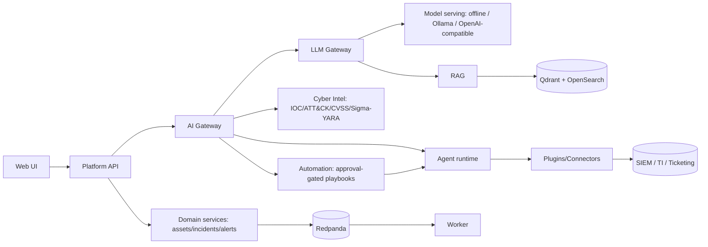

# Dula — Cybersecurity AI Platform

> **Dula** is from the Oromo language — *Duulaa* (a warrior/knight), *Abbaa Duulaa* (a
> traditional war leader/defense commander). Naming decided in [ADR-0001](docs/adr/ADR-0001-product-naming.md).

An independently-built, from-scratch **cybersecurity AI ecosystem**: a full application
platform (auth, domain services, RAG-grounded Q&A, permissioned agents, sandboxed
integrations, security automation) plus **Dula AI**, a cybersecurity-specialized model and
the training/evaluation pipeline that produces it — designed to run **anywhere the data
must live**, including fully **air-gapped/offline**.

This is a solo portfolio project, built through 11 completed milestones across ~30 merged
PRs, each closed with tests, a security pass, and documentation before moving on. It is
**not deployed anywhere real** — see [Status & honesty notes](#status--honesty-notes) below
for exactly what that does and doesn't mean.

## What's Actually Built

| Area | Status | What exists |
|---|---|---|
| Platform core (auth, domain API, UI) | ✅ **Complete** | Keycloak OIDC + OPA authz, multi-tenant Postgres (RLS), assets/incidents/alerts CRUD with filter/search/sort/pagination, a Next.js UI |
| LLM Gateway + RAG | ✅ **Complete** | Model-agnostic gateway (offline extractive + Ollama + OpenAI-compatible providers), Qdrant + OpenSearch hybrid retrieval, per-tenant budgets/caching, prompt-injection red-team suite |
| Cyber Intelligence | ✅ **Complete** | Deterministic IOC/ATT&CK extraction → STIX 2.1, CVSS v3.1 + explainable prioritization, Sigma/YARA authoring with always-validated output |
| Agent runtime | ✅ **Complete** | Plan/act loop with per-call permission checks, human approval for consequential actions, step/cost/time limits, full audit trace; a release-blocking safety suite proves zero unauthorized actions |
| Plugins & connectors | ✅ **Complete** | Ed25519-signed manifests, default-deny egress + SSRF protection, host-brokered sandbox; SIEM/threat-intel/ticketing connectors |
| Security automation | ✅ **Complete** | Declarative, approval-gated playbooks composed over the agent runtime; grounded incident reporting |
| Production deployment substrate | ✅ **Complete** *(buildable scope)* | One Helm chart, four profile overlays (cloud/on-prem/hybrid/air-gapped), hardened pods, Gateway API edge, cosign+SBOM+Kyverno supply chain, backup/DR, observability |
| MLOps at scale | ✅ **Complete** | Model registry lifecycle (stage/promote/rollback), canary traffic routing, scheduled drift monitoring with auto-rollback |
| **Dula AI (trained model)** | 🚧 **In progress** | Real QLoRA fine-tuning pipeline, run twice on free GPU credit — both candidates **honestly retired** by the evaluation gate (see below). A third candidate (larger base + a DPO safety-restoration pass) is code-complete and queued to run. **No Dula AI checkpoint has shipped**; the platform runs on a general model + RAG today. |
| Live operational deployment | ⏳ **Not started** | Everything above is validated locally/in CI. A real multi-profile deploy, external penetration test, and a DR drill are infrastructure-dependent next steps, not code work. |

Full detail, with every verification claim and what was deferred, in
[docs/PROJECT_STATE.md](docs/PROJECT_STATE.md) (updated after every milestone) and the
[per-milestone closure reports](docs/04-MVP-Roadmap/closure/).

## Status & Honesty Notes

The evaluation gate in the ML pipeline has said **retire** twice, on real trained models,
because each one made the base model measurably less safe even where it got more accurate.
Both retirements are on the record with their exact numbers
([docs/09-MLOps/ModelRegistry.md](docs/09-MLOps/ModelRegistry.md)) rather than quietly
dropped. That's not a gap in the project — it's the point of having a gate: shipping a
worse or less-safe model was never on the table, and the pipeline proved it can tell the
difference. The platform itself doesn't wait on this — it serves grounded answers from a
general model + RAG today, and swaps in a Dula AI checkpoint with no application change
whenever one actually clears the bar.

"Production deployment substrate — complete" means the Helm charts, hardened pods, admission
policy, and CI gates are real and validated (`helm lint`/`kubeconform`/policy checks green,
a live Postgres backup/restore round-trip executed). It does not mean this is running in a
real cloud account today — that step needs real infrastructure and is explicitly the next
gate before any GA claim ([docs/11-Deployment/GAReadiness.md](docs/11-Deployment/GAReadiness.md)).

## Architecture



Full detail: [docs/03-Architecture/SystemArchitecture.md](docs/03-Architecture/SystemArchitecture.md).
Sixteen ADRs record every structural decision and why: [docs/adr/](docs/adr/).

## Why This Exists

Most "AI security" demos are a chatbot with a system prompt. Dula is an attempt to build
the actual surrounding system a security team would need to trust one: permissioned
agents instead of free-running tool calls, a sandboxed plugin model instead of ambient
network access, a real evaluation gate instead of "looks good to me," and a deployment
story that survives an air-gapped network instead of assuming a SaaS API is always
reachable. The engineering discipline — tests and a security pass at every PR boundary,
docs kept current as a completion requirement, ADRs for every structural choice — is as
much the point of this project as any single feature.

## Documentation

The full engineering handbook lives in [docs/](docs/README.md):

- [docs/README.md](docs/README.md) — reading order
- [docs/SUMMARY.md](docs/SUMMARY.md) — complete index
- [docs/PROJECT_CONTEXT.md](docs/PROJECT_CONTEXT.md) — durable project knowledge
- [docs/PROJECT_STATE.md](docs/PROJECT_STATE.md) — current execution state, updated continuously
- [docs/adr/](docs/adr/) — all 16 accepted architecture decisions

## Try It Locally

[**RUNNING.md**](RUNNING.md) is the full copy-paste guide — every URL and dev credential
included. The short version:

```bash
cp .env.example .env
make up                                          # Postgres, Redis, Qdrant, OpenSearch, MinIO, Redpanda, Keycloak, OPA

uv sync --all-packages
cd apps/platform-api && uv run alembic upgrade head && cd ../..
uv run uvicorn dula_platform_api.main:app --reload --port 8000     # Platform API
uv run --directory apps/ai-gateway uvicorn dula_ai_gateway.main:app --reload --port 8100  # AI Gateway

cp apps/web/.env.local.example apps/web/.env.local
pnpm install && pnpm --filter web dev            # http://localhost:3000
```

Sign in with the seeded Keycloak user **`maya` / `maya`**. Quality gates:
`uv run ruff check . && uv run mypy packages apps && uv run pytest`.

## Tech Stack

Python 3.12 (FastAPI) + Next.js/TypeScript, Postgres 16 + Alembic, Qdrant + OpenSearch,
Redpanda (Kafka API), Keycloak + OPA, LangGraph-style agent runtime, MLflow + DVC + Argo
Workflows, Helm + Kyverno + cosign/syft/grype, OpenTelemetry/Prometheus/Grafana. Full
rationale for every choice: [docs/01-Project/TechnologyStack.md](docs/01-Project/TechnologyStack.md).

## Security

Security is a first-class constraint, not an afterthought: every AI surface is threat-modeled
against the OWASP Top 10 for LLM Applications, multi-tenancy is enforced in depth (app scope +
Postgres RLS + index namespacing + AI-layer isolation), and every agent/plugin action is
permissioned, approved, and audited. Details: [docs/10-Security/](docs/10-Security/README.md).
**Dula is defensive-only** — it does not build offensive/attack-automation capabilities.

## License

Apache-2.0 — see [LICENSE](LICENSE).

## Roadmap

Phases 01–10 (foundation through MLOps-at-scale) are complete; see
[docs/04-MVP-Roadmap/](docs/04-MVP-Roadmap/) for what's next.
