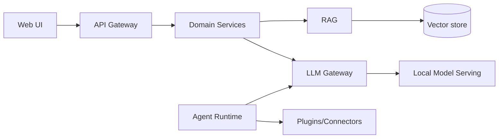

# Dula — Cybersecurity AI Platform + Dula AI

> **Status: Documentation Bootstrap (M000).** This repository currently contains the
> **engineering documentation foundation only**. No application code, models, or
> infrastructure exist yet. **This is not production-ready and makes no such claim.**
>
> Product names are **decided** (ADR-0001): **Dula** (the platform / ecosystem) and
> **Dula AI** (the LLM). *Dula* is from the Oromo language — *Duulaa* (a warrior/knight),
> *Abbaa Duulaa* (war leader / defense commander). Trademark clearance remains a business
> task before commercial use — see [docs/02-Vision/Vision.md](docs/02-Vision/Vision.md).

## What This Is

A serious, production-grade **cybersecurity AI ecosystem** (not a chatbot), comprising two
integrated but **independently deployable** products:

- **Dula Platform (Product 1)** — an enterprise cybersecurity AI platform: SOC
  assistance, threat detection & hunting, incident response, threat intelligence,
  vulnerability & malware-analysis assistance, log analysis, detection engineering,
  forensics assistance, cloud/Kubernetes security, automation, reporting, investigation,
  knowledge management, AI agents, and security-tool integrations.
- **Dula AI (Product 2)** — cybersecurity-specialized language model(s) plus the
  training, evaluation, and serving stack around them, designed to run **locally/offline**.

It is designed to deploy **anywhere the data must live**: cloud, on-premises, hybrid,
Docker, Kubernetes, and fully **air-gapped/offline**.

## Current Status

| Aspect | Status |
|--------|--------|
| Documentation foundation | ✅ Complete (Draft, M000) |
| Application code | ❌ Not started |
| Models trained | ❌ Not started |
| Production readiness | ❌ Not claimed |

Execution state: [docs/PROJECT_STATE.md](docs/PROJECT_STATE.md).

## Architecture Overview

A model-agnostic platform with a central **LLM gateway**, **RAG** grounding over
legitimate security knowledge, safe **agents** (permissioned tools + human approval),
sandboxed **plugins/connectors**, and defense-in-depth **security** — all self-hostable.



Details: [docs/03-Architecture/SystemArchitecture.md](docs/03-Architecture/SystemArchitecture.md).

## Documentation

The full engineering handbook lives in [docs/](docs/README.md). Start with:

- [docs/README.md](docs/README.md) — handbook guide & reading order
- [docs/SUMMARY.md](docs/SUMMARY.md) — complete index
- [docs/PROJECT_CONTEXT.md](docs/PROJECT_CONTEXT.md) — long-lived project knowledge
- [docs/02-Vision/Vision.md](docs/02-Vision/Vision.md) — vision & scope
- [docs/01-Project/TechnologyStack.md](docs/01-Project/TechnologyStack.md) — tech choices

## Development Roadmap

Empty repo → first usable MVP (Phase 03, RAG on a general model) → GA/production-ready
(Phase 09) → advanced Dula AI (Phase 11). See
[docs/04-MVP-Roadmap/MVPOverview.md](docs/04-MVP-Roadmap/MVPOverview.md).

## Development Prerequisites

Docker, Node 20+ with `pnpm`, and [`uv`](https://docs.astral.sh/uv/) (manages Python 3.12).
Full stack rationale: [docs/01-Project/TechnologyStack.md](docs/01-Project/TechnologyStack.md).

## Local Development (Phase 01)

```bash
cp .env.example .env
make up                                   # dev stack: Postgres, Redis, Qdrant, OpenSearch, MinIO, Redpanda, Keycloak

# Backend (Platform API) — http://localhost:8000  (docs at /docs)
uv sync --all-packages
cd apps/platform-api && uv run alembic upgrade head && cd ../..
uv run uvicorn dula_platform_api.main:app --reload

# Frontend — http://localhost:3000
cp apps/web/.env.local.example apps/web/.env.local   # set AUTH_SECRET
pnpm install
pnpm --filter web dev
```

Sign in with the seeded Keycloak user **`maya` / `maya`**; the home page then shows the
verified identity from `GET /api/v1/me` (end-to-end OIDC per ADR-0009). Quality gates:
`uv run ruff check . && uv run mypy packages apps && uv run pytest`.

## Contribution

See [docs/00-Governance/](docs/00-Governance/RepositoryGovernance.md): coding standards,
Git/PR workflow, ADR process, and **AI contribution guidelines** (this bootstrap was
AI-assisted and is Draft pending human verification).

## Security

Security is a first-class constraint. See [docs/10-Security/](docs/10-Security/README.md)
(threat models, secure development, AI/agent/plugin security). Dula is **defensive-only**
— it does not build offensive/attack-automation capabilities
([docs/02-Vision/GuidingPrinciples.md](docs/02-Vision/GuidingPrinciples.md)).

## License

**License: TBD (placeholder).** A licensing/commercial model decision is pending; the
dependency policy favors permissive/OSS to keep options open
([docs/01-Project/Dependencies.md](docs/01-Project/Dependencies.md)).

## Future Direction

Retrieval-grounded assistance → specialized Dula AI → safe supervised agents → an
extensible security-AI ecosystem, always preserving self-hostable and air-gapped
operation. See [docs/03-Architecture/ArchitectureRoadmap.md](docs/03-Architecture/ArchitectureRoadmap.md)
and [docs/08-AI/AIResearchRoadmap.md](docs/08-AI/AIResearchRoadmap.md).
