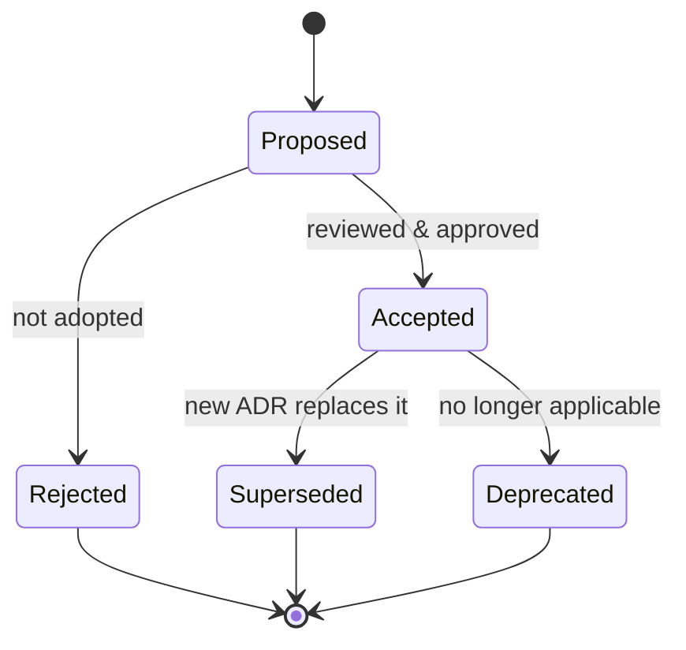

# Architecture Decision Records (ADR) Process

> **Purpose.** Define how significant technical decisions are proposed, recorded,
> approved, and superseded, so the *reasons* behind the architecture survive turnover.

## 1. What Is an ADR

An ADR captures a single architecturally significant decision: the context, the options
considered, the decision made, and the consequences. ADRs are immutable once approved —
a changed decision is a *new* ADR that supersedes the old one.

An "architecturally significant" decision is one that is costly to reverse or that
affects structure, cross-cutting concerns, security, deployment, or the AI strategy.
Examples: choice of vector database, agent permission model, model-serving runtime,
multi-tenancy isolation strategy.

## 2. ADR Location & Numbering

- ADRs live in `docs/adr/` (created when the first ADR is written).
- Filename: `ADR-NNNN-short-title.md` with zero-padded sequential numbers
  (`ADR-0001-vector-database-selection.md`).
- Numbers are never reused. Superseded ADRs keep their number and status.

## 3. ADR Template

```markdown
# ADR-NNNN: <Title>

- Status: Proposed | Accepted | Rejected | Superseded by ADR-XXXX | Deprecated
- Date: YYYY-MM-DD
- Deciders: <names/roles>
- Related: <links to docs, issues, other ADRs>

## Context
What problem/force requires a decision? Constraints, requirements, assumptions.

## Options Considered
1. Option A — pros / cons
2. Option B — pros / cons
3. Option C — pros / cons

## Decision
The option chosen and the reasoning.

## Consequences
Positive, negative, and neutral results. Follow-on work. Risks accepted.

## Compliance / Verification
How we will know the decision is being honored (tests, CI checks, reviews).
```

## 4. Lifecycle



- **Proposed** ADRs are opened as PRs and discussed.
- **Accepted** requires sign-off from the relevant owner (Architecture for structural,
  Security lead for security-impacting, AI lead for model/AI decisions).
- **Superseding**: the new ADR references the old (`Supersedes ADR-XXXX`), and the old
  ADR's status becomes `Superseded by ADR-YYYY`. Content of the old ADR is never edited
  except to add the superseded pointer.

## 5. When an ADR Is Required

An ADR is mandatory for any decision tagged **REQUIRES DECISION** in the documentation,
and for any change that:

- introduces or removes a core technology (datastore, queue, model runtime, framework);
- changes a trust boundary or the authN/authZ model;
- changes the multi-tenancy, deployment, or data-isolation model;
- changes the Dula AI training/inference approach or model-selection baseline;
- changes the agent or plugin permission/execution model.

## 6. ADR Register

The ten bootstrap decisions were **resolved during the M000 review** (see
[../PROJECT_REVIEW-M000.md](../PROJECT_REVIEW-M000.md)) and recorded as ADR files in
[../adr/](../adr/ADR-0001-product-naming.md). All are **Accepted**.

| ADR | Topic | Decision (short) | Status |
|-----|-------|------------------|--------|
| [0001](../adr/ADR-0001-product-naming.md) | Product & ecosystem naming | Dula / Dula AI (Oromo) | Accepted |
| [0002](../adr/ADR-0002-backend-language.md) | Backend language | Python 3.12 + FastAPI primary; Go approved for data-plane | Accepted |
| [0003](../adr/ADR-0003-vector-database.md) | Vector DB & search | **Qdrant** (vectors) + **OpenSearch** (BM25/log-analytics) | Accepted |
| [0004](../adr/ADR-0004-event-backbone.md) | Event & streaming backbone | **Redpanda (Kafka API)** — permanent | Accepted |
| [0005](../adr/ADR-0005-model-serving-runtime.md) | Serving runtime | vLLM + llama.cpp (Ollama dev) | Accepted |
| [0006](../adr/ADR-0006-multi-tenancy.md) | Multi-tenancy | Logical isolation + AI-layer isolation | Accepted |
| [0007](../adr/ADR-0007-base-model.md) | Base model | Apache-2.0 (Qwen/Mistral); Llama deprioritized | Accepted |
| [0008](../adr/ADR-0008-agent-runtime.md) | Agent runtime | Build on LangGraph + first-party security layer | Accepted |
| [0009](../adr/ADR-0009-auth-stack.md) | Auth stack | Keycloak (OIDC) + OPA (Rego) | Accepted |
| [0010](../adr/ADR-0010-mlops-tooling.md) | MLOps tooling | MLflow + DVC + Argo Workflows | Accepted |
| [0011](../adr/ADR-0011-monorepo.md) | Repository model | Monorepo (`dula`) | Accepted |
| [0012](../adr/ADR-0012-training-and-hosting.md) | Dula AI training compute & artifact hosting | GitHub + HF Hub + free GPU (Kaggle/Lightning/Modal) | Accepted |
| [0013](../adr/ADR-0013-plugin-sandbox.md) | Plugin sandbox mechanism | Out-of-process worker + host-brokered capabilities (baseline) + container per profile; pluggable runner | Accepted |
| [0014](../adr/ADR-0014-edge-gateway.md) | Edge / API gateway | **Envoy Gateway (Kubernetes Gateway API)** at the edge; FastAPI services behind it | Accepted |
| [0015](../adr/ADR-0015-supply-chain-release-integrity.md) | Supply-chain & release integrity | cosign **keyed** signing + syft SBOM + grype gate + **Kyverno** admission; **SLSA Build L3** | Accepted |

### Still open (tracked, not yet ADRs)

- **Embedding/reranker model, hardware sizing** — **REQUIRES RESEARCH** (empirical; measured when
  the relevant phase arrives — not architectural).

Resolved since M000: **API gateway technology** → ADR-0014 (Envoy Gateway / Gateway API); the
**admission-control tool** and **SLSA target level** → ADR-0015 (Kyverno; SLSA Build L3).

Note: the vector store, search/log-analytics engine, and event backbone are **no longer
open or staged** — they are permanent decisions (ADR-0003, ADR-0004). ClickHouse is not
adopted; OpenSearch is the standard search/log-analytics engine.

## Related Documents

- [../03-Architecture/ArchitectureRoadmap.md](../03-Architecture/ArchitectureRoadmap.md)
- [RepositoryGovernance.md](./RepositoryGovernance.md)
