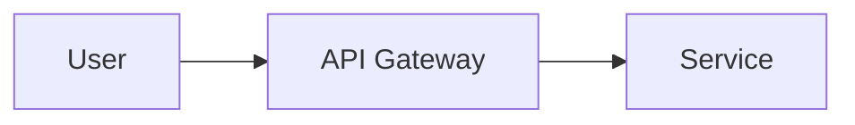
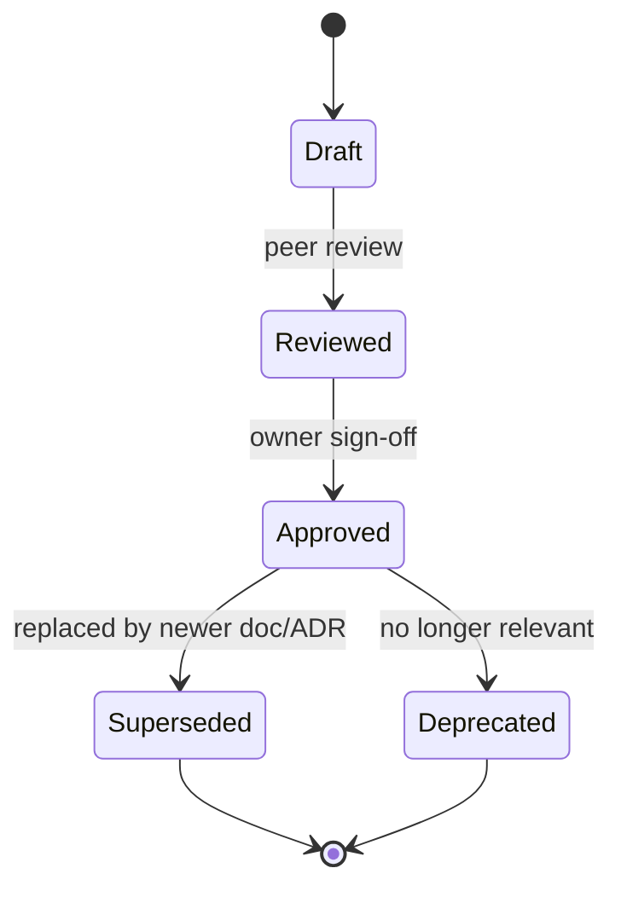

# Documentation Standards

> **Purpose.** Define how documentation is written, structured, reviewed, versioned,
> and maintained across the Dula ecosystem so that the corpus stays internally
> consistent and usable by a team that was not present when it was written.

## 1. Scope

These standards apply to **all** Markdown documentation under `docs/`, including
architecture, roadmap, AI/ML strategy, security, and operational documents. Source
code comments and API reference material generated from code are governed by
[CodingStandards.md](./CodingStandards.md) and the API documentation tooling.

## 2. Format

- All documentation is authored in **GitHub-Flavored Markdown (GFM)**.
- One document = one clearly scoped responsibility. Do not create "kitchen-sink"
  documents. If a document exceeds ~600 lines, evaluate splitting it.
- Line length is soft-wrapped; do not hard-wrap prose at a fixed column. Wrap only
  where it aids diff readability (e.g. one sentence per line is acceptable).
- Use ATX headings (`#`, `##`) only. Exactly one `#` (H1) per document.
- Use fenced code blocks with a language hint (` ```python `, ` ```yaml `, ` ```bash `).
- Use relative links for all cross-references (see §6).

## 3. Required Document Metadata

Every document begins with a YAML front-matter block:

```yaml
---
title: <Human readable title>
document_id: <AREA-NNN>          # e.g. ARC-003, AI-005 — see NamingConventions.md
status: Draft | Reviewed | Approved | Superseded | Deprecated
version: <semver>                # documentation semver, independent of product
last_updated: <YYYY-MM-DD>
owner: <Role or team>
audience: <Primary readers>
phase: <Roadmap phase this reflects>
related:                         # optional list of relative links
  - ../path/to/related.md
---
```

`document_id` prefixes are fixed per area (GOV, PRJ, VIS, ARC, MVP, BE, FE, DB, AI,
MLO, SEC, DEP, API, AGT, PLG, TST, OPS). See [NamingConventions.md](./NamingConventions.md).

## 4. Document Structure

Each document should follow this shape:

1. **H1 title** matching front-matter `title`.
2. **Purpose blockquote** — one or two sentences on why the document exists.
3. **Numbered sections** with descriptive headings.
4. **Assumptions / Decisions / Future Work / Requires Research** callouts where relevant.
5. **Related documents** links (either in front-matter `related` or a closing section).

### 4.1 Status Callouts

Use these bold inline tags to keep maturity honest (per project instruction to not
overstate capability):

- **CURRENT** — implemented and true today.
- **MVP** — targeted for the first usable release.
- **FUTURE** — planned beyond MVP.
- **RESEARCH** — direction under investigation; not committed.
- **EXPERIMENTAL** — prototyped but not production-bound.
- **REQUIRES RESEARCH** — an open question no one has resolved yet; must not be
  presented as settled fact.
- **REQUIRES DECISION** — an option space awaiting an owner's decision (often an ADR).

Because the repository is at bootstrap, **almost everything is FUTURE or MVP**. Do not
tag anything CURRENT unless the corresponding code or infrastructure actually exists.

## 5. Diagrams

- Prefer **Mermaid** fenced blocks (` ```mermaid `) so diagrams are diffable and render
  in GitHub/most viewers without binary assets.
- Every diagram must have a one-line caption above or below explaining what it shows.
- Keep diagrams focused: one concept per diagram. Split large diagrams.
- Diagram source lives inline in the document, not in separate binary files, unless the
  diagram cannot be expressed in Mermaid (then store an editable source + exported SVG
  in an `assets/` folder next to the document).

Example:



## 6. Cross-References

- Always link related documents using **relative paths** (e.g.
  `../03-Architecture/SystemArchitecture.md`).
- When you state a decision made elsewhere, link to the authoritative document rather
  than restating it. Duplication drifts; links do not.
- The authoritative index is [../SUMMARY.md](../SUMMARY.md). Any new document must be
  added there.

## 7. Terminology

- Use terms exactly as defined in [../01-Project/Glossary.md](../01-Project/Glossary.md).
- If you introduce a new term, add it to the Glossary in the same change.
- Product names: **Dula Platform** (Product 1), **Dula AI** (Product 2), **Dula**
  (the combined ecosystem). Decided in ADR-0001 — see
  [../02-Vision/Vision.md](../02-Vision/Vision.md).

## 8. Versioning & Lifecycle

Documentation is version-controlled in Git and follows this lifecycle:



- Documentation `version` uses semver semantics: patch = typo/clarity, minor = new
  content, major = restructure or reversal of a documented decision.
- `last_updated` must change on every substantive edit.
- Superseded documents are **not deleted**; they get `status: Superseded` and a link to
  the replacement, preserving decision history.

## 9. Review Process

- Every documentation change goes through a Pull Request (see
  [RepositoryGovernance.md](./RepositoryGovernance.md)).
- Minimum one human reviewer who is not the primary author.
- Architecture and security documents require review from the respective owner.
- AI-generated or AI-assisted documentation follows
  [AIContributionGuidelines.md](./AIContributionGuidelines.md), including the mandatory
  human validation step.

## 10. Quality Bar

A document is acceptable only if it:

- Has a clear, single purpose.
- Avoids unsupported claims and does not invent facts about external systems.
- Marks open questions with **REQUIRES RESEARCH** / **REQUIRES DECISION**.
- Distinguishes CURRENT / MVP / FUTURE / RESEARCH maturity.
- Cross-references rather than duplicates.
- Reads correctly without access to the conversation or context that produced it.

## Related Documents

- [CodingStandards.md](./CodingStandards.md)
- [ArchitectureDecisionRecords.md](./ArchitectureDecisionRecords.md)
- [NamingConventions.md](./NamingConventions.md)
- [RepositoryGovernance.md](./RepositoryGovernance.md)
- [AIContributionGuidelines.md](./AIContributionGuidelines.md)
