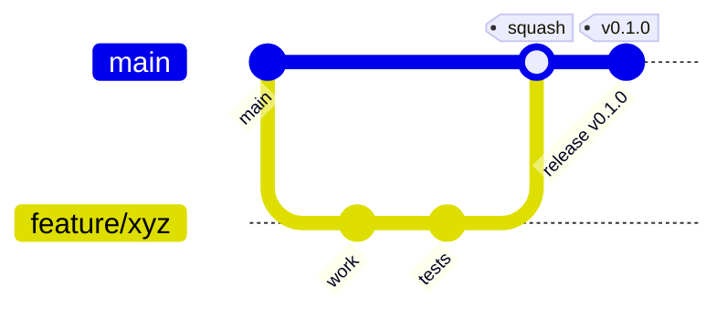

# Repository Governance

> **Purpose.** Define how the repository is structured, branched, reviewed, and released,
> and the security gates every change must pass.

## 1. Repository Model

- **REQUIRES DECISION** (ADR candidate): monorepo vs polyrepo. The bootstrap
  recommendation is a **monorepo** for the two products plus shared libraries and infra,
  because Dula Platform and Dula AI share contracts, evaluation harnesses, and deployment
  tooling. Independent deployability is preserved via per-service build/release pipelines.
- Top-level layout is defined in [../01-Project/ProjectStructure.md](../01-Project/ProjectStructure.md).

## 2. Branching Strategy

Trunk-based development with short-lived branches:

- `main` is always releasable and protected.
- Branch names: `feature/<short-desc>`, `fix/<short-desc>`, `chore/<short-desc>`,
  `docs/<short-desc>`, `adr/<number>-<short-desc>`.
- Long-lived branches are discouraged; rebase or merge frequently.
- Releases are cut from `main` via tags; hotfixes via `fix/*` fast-tracked.

## 3. Commit Conventions

- **Conventional Commits**: `type(scope): summary`.
  Types: `feat`, `fix`, `docs`, `refactor`, `test`, `chore`, `perf`, `build`, `ci`,
  `security`.
- Commit body explains *why*; footer references issues/ADRs (`Refs: ADR-0003`).
- Commits authored with AI assistance follow
  [AIContributionGuidelines.md](./AIContributionGuidelines.md) and include the required
  co-authorship trailer.

## 4. Pull Requests

- All changes land via PR — no direct pushes to `main`.
- PR description: what, why, how tested, security impact, docs updated.
- **Required checks** before merge:
  1. Lint + format
  2. Type check
  3. Unit + integration tests (coverage gate)
  4. SAST + dependency vulnerability scan
  5. Secret scan
  6. Build succeeds (all affected images)
  7. Docs updated (for behavior/architecture changes)
- Squash-merge by default to keep `main` history linear and legible.

## 5. Code Review

- Minimum **one** approving human reviewer who is not the author; **two** for changes to
  security-critical paths (authN/authZ, agent/plugin execution, secrets, crypto,
  model-serving), per [../10-Security/SecureDevelopment.md](../10-Security/SecureDevelopment.md).
- Reviewers verify correctness, security, tests, and documentation — not just style
  (style is automated).
- CODEOWNERS routes reviews to the owning team automatically.

## 6. Releases

- **Semantic Versioning** for each independently deployable artifact.
- Each product (Dula Platform, Dula AI services) versions independently but is tested
  together in a compatibility matrix. See [../01-Project/ReleaseStrategy.md](../01-Project/ReleaseStrategy.md).
- Every release produces: signed container images, an SBOM, a provenance attestation,
  and a changelog (see [../10-Security/SupplyChainSecurity.md](../10-Security/SupplyChainSecurity.md)).

## 7. Security Requirements

- Signed commits (**REQUIRES DECISION**: enforce GPG/sigstore) recommended for
  protected branches.
- No secrets committed; pre-commit secret scanning is mandatory.
- Dependency changes require a passing vulnerability scan and license check.
- Branch protection: required reviews, required status checks, no force-push to `main`.

## 8. Issue & Work Tracking

- Work is tracked as issues linked to roadmap milestones
  ([../04-MVP-Roadmap/MVPOverview.md](../04-MVP-Roadmap/MVPOverview.md)).
- Execution state is mirrored in [../PROJECT_STATE.md](../PROJECT_STATE.md).

## Related Documents

- [./AIContributionGuidelines.md](./AIContributionGuidelines.md)
- [../01-Project/ReleaseStrategy.md](../01-Project/ReleaseStrategy.md)
- [../10-Security/SupplyChainSecurity.md](../10-Security/SupplyChainSecurity.md)
