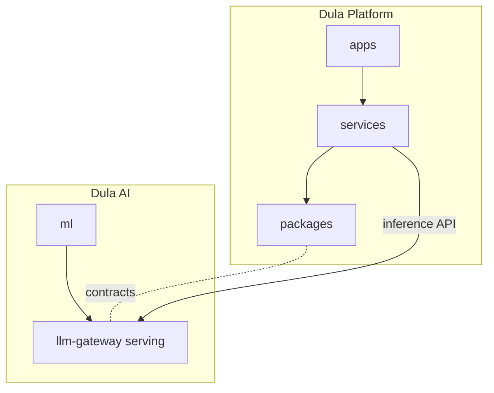

# Project Structure

> **Purpose.** Define the planned repository layout so contributors know where code,
> infrastructure, and documentation will live. **Status: MVP target** — only `docs/`
> exists today.

## 1. Top-Level Layout (Planned)

```text
/
├── docs/                 # Engineering handbook (this documentation) — EXISTS
├── adr/                  # Architecture Decision Records (created with ADR-0001)
├── apps/
│   ├── platform-api/     # Dula Platform backend (FastAPI services)
│   ├── web/              # Frontend (Next.js)
│   └── worker/           # Async workers (ingestion, enrichment, agent runs)
├── services/
│   ├── llm-gateway/      # Model provider/runtime abstraction
│   ├── rag-service/      # Retrieval + indexing
│   ├── agent-runtime/    # Agent orchestration & tool execution
│   └── connectors/       # Plugin/connector host
├── packages/             # Shared libraries (contracts, auth, telemetry, clients)
│   ├── contracts/        # OpenAPI/proto, generated types
│   ├── common-py/        # Shared Python utilities
│   └── common-ts/        # Shared TypeScript utilities
├── ml/
│   ├── datasets/         # Dataset build/versioning configs (data itself is external)
│   ├── training/         # Fine-tuning / training pipelines
│   ├── evaluation/       # Benchmarks & eval harness
│   └── serving/          # Model packaging & serving configs
├── deploy/
│   ├── docker/           # Dockerfiles, docker-compose profiles
│   ├── helm/             # Helm charts
│   ├── k8s/              # Base manifests / kustomize overlays
│   └── terraform/        # IaC (cloud + on-prem primitives)
├── tools/                # Dev tooling, scripts, generators
├── tests/                # Cross-service integration/e2e/security test suites
└── .github/              # CI/CD workflows, CODEOWNERS, templates
```

This mirrors a **monorepo** recommendation (see
[../00-Governance/RepositoryGovernance.md](../00-Governance/RepositoryGovernance.md)) —
**REQUIRES DECISION** (ADR candidate).

## 2. Product Boundaries in the Repo

- **Dula Platform (Product 1)** = `apps/`, `services/`, `packages/`, plus its slice of
  `deploy/`.
- **Dula AI (Product 2)** = `ml/`, the model-serving configs in `services/llm-gateway`,
  and its slice of `deploy/`.
- Shared contracts in `packages/contracts` are the seam that keeps them independently
  deployable while interoperable.



## 3. Conventions

- Directory and file naming follows [../00-Governance/NamingConventions.md](../00-Governance/NamingConventions.md).
- Each service/app owns its `Dockerfile`, tests, and README.
- Infra is declarative; no environment-specific logic baked into application code.

## 4. What Exists Today

Only `docs/`. Everything else is created during the roadmap
([../04-MVP-Roadmap/MVPOverview.md](../04-MVP-Roadmap/MVPOverview.md)), beginning with
Phase 01 scaffolding.
