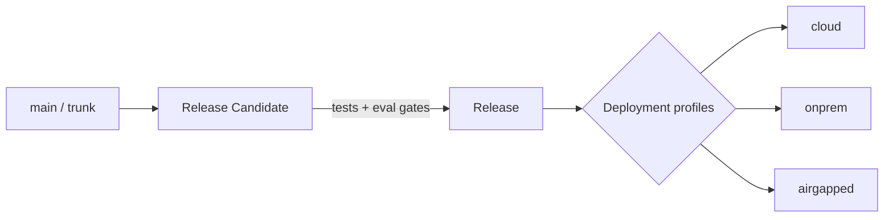

# Release Strategy

> **Purpose.** Define how the two products are versioned and released, and how their
> releases stay compatible across the supported deployment profiles.

## 1. Versioning

- **Semantic Versioning** for each independently deployable artifact.
- **Dula Platform** and **Dula AI** version **independently** but ship within a tested
  **compatibility matrix** so operators know which platform version supports which model
  release.
- Documentation carries its own semver (see
  [../00-Governance/DocumentationStandards.md](../00-Governance/DocumentationStandards.md)).

## 2. Release Trains

- Cut RCs from `main`; promote to release after passing test, security, and
  (for Dula AI) evaluation gates.
- Model releases additionally pass the evaluation/benchmark gates in
  [../08-AI/EvaluationStrategy.md](../08-AI/EvaluationStrategy.md) and follow the
  lifecycle in [../09-MLOps/ModelLifecycle.md](../09-MLOps/ModelLifecycle.md).

## 3. Artifacts Per Release

- Signed container images + SBOM + provenance.
- Helm charts pinned to image digests.
- Dula AI model artifacts (weights, adapters, quantized variants) registered in the model
  registry with eval reports.
- Changelog and upgrade notes (including migration steps).

## 4. Deployment Profiles & Compatibility

- Each release is validated against all supported profiles: cloud, on-prem, hybrid, and
  **air-gapped** (offline bundle). See [../11-Deployment/README.md](../11-Deployment/README.md).
- Air-gapped releases ship as a self-contained offline bundle (images + charts + models +
  SBOM) importable into a private registry.

## 5. Backward Compatibility

- API changes follow [../12-API/Versioning.md](../12-API/Versioning.md) (additive within
  a major; breaking changes require a new major + deprecation window).
- Database migrations are forward-only in production
  ([../07-Database/MigrationStrategy.md](../07-Database/MigrationStrategy.md)).
- Model prompt/response contracts are versioned so agents/RAG can pin behavior.

## 6. Cadence

- **MVP phase:** frequent small releases from trunk.
- **Post-GA:** predictable minor cadence with patch releases for security fixes; model
  releases decoupled and gated on evaluation improvements/regressions.

> **Status:** All of the above is **MVP/FUTURE**; no releases exist yet.
