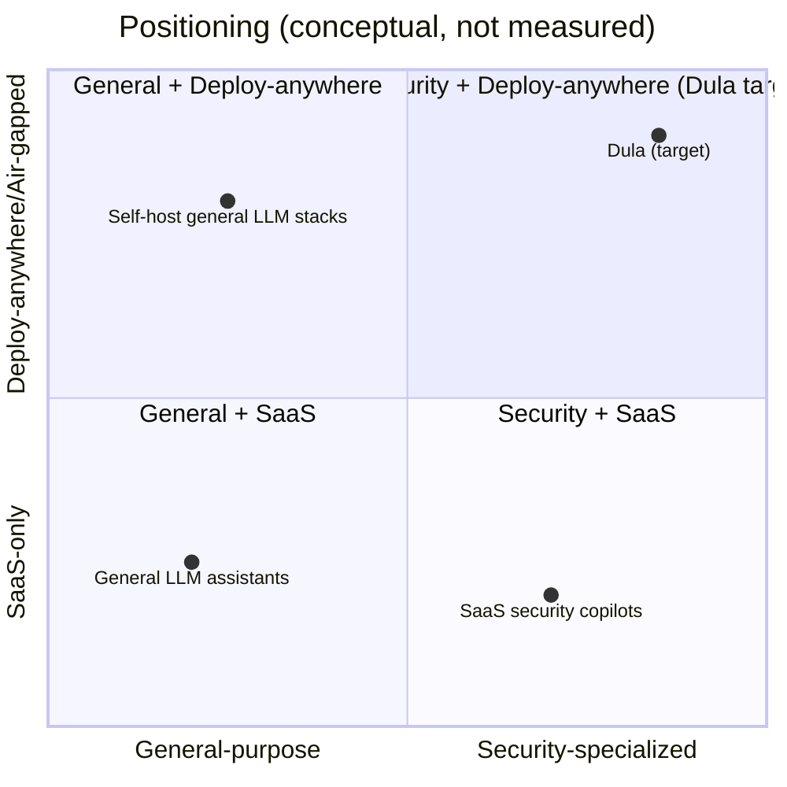

# Competitive Landscape

> **Purpose.** Frame the category and where Dula differentiates. This is a **conceptual**
> framing, not a market analysis. Specific vendor claims, pricing, and feature comparisons
> are **REQUIRES RESEARCH** and must be verified against primary sources before external use.

## 1. Category Landscape (Conceptual)

## 2. Adjacent Categories

- **SaaS security copilots** embedded in vendor SIEM/XDR suites — convenient but
  cloud-bound and tied to one vendor's data.
- **General LLM assistants / RAG frameworks** — flexible but not security-specialized and
  not turnkey for SOC workflows.
- **Self-hosted LLM platforms** — deploy-anywhere but general-purpose, lacking security
  content, integrations, and safe-agent controls.
- **Traditional SIEM/SOAR/EDR** — the systems Dula **integrates with**, not replaces.

## 3. Dula Differentiators

1. **Deploy-anywhere incl. air-gapped/offline** from one codebase.
2. **Data sovereignty** — no mandatory external calls.
3. **Security specialization** via Dula AI + curated security knowledge (RAG).
4. **Safe agents** — permissioned tools + human approval as core design.
5. **Grounded & auditable** AI with evidence citations.
6. **Open, portable stack** avoiding vendor lock-in.

## 4. Risks vs Incumbents

- Incumbents have data-integration breadth and distribution. Dula counters with
  portability, sovereignty, openness, and specialization — but must reach parity on core
  workflows (triage/hunt/IR) quickly. This informs the roadmap sequencing in
  [../04-MVP-Roadmap/MVPOverview.md](../04-MVP-Roadmap/MVPOverview.md).

## 5. What We Are NOT Competing On

- Being another SaaS-only copilot.
- Being a foundation-model lab (we specialize open models; from-scratch pretraining is
  **RESEARCH** only — see [../08-AI/DulaAIStrategy.md](../08-AI/DulaAIStrategy.md)).

> **REQUIRES RESEARCH:** A concrete competitive matrix with named products and verified
> capabilities should be produced by product/marketing before any external claims.
