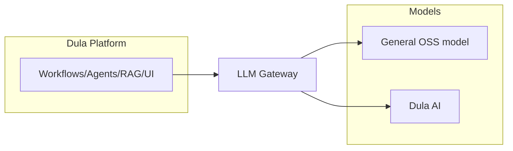

# Product Strategy

> **Purpose.** Explain product boundaries, the relationship between the two products,
> sequencing, differentiation, and explicit non-goals and success criteria.

## 1. Two Products, One Ecosystem

- **Dula Platform** delivers value even using a *general* open model — the platform's
  RAG, agents, integrations, and workflows are useful on day one of the model journey.
- **Dula AI** increases quality/efficiency of the platform over time and can also be
  consumed independently (e.g. via API) by teams who only want the model.
- The seam between them is a **model-agnostic LLM gateway** and versioned contracts, so
  the platform is never blocked on model progress and the model is never coupled to
  platform internals.

## 2. Strategic Sequencing (Why This Order)

1. **Platform first on a general model** — deliver useful, grounded assistance quickly
   via RAG + tools without waiting for a trained model.
2. **Layer Dula AI in** as data, evaluation, and tuning mature — measured against a
   benchmark so we only ship models that are actually better.
3. **Automate with agents** once tools, permissions, and human-approval controls are
   proven safe.

This mirrors the AI progression in [../08-AI/DulaAIStrategy.md](../08-AI/DulaAIStrategy.md).

## 3. Differentiation

- **Deploy-anywhere, including air-gapped/offline** — a hard requirement many
  competitors don't meet.
- **Data sovereignty** — sensitive security data never has to leave the customer boundary.
- **Grounded & auditable** — every AI answer/action cites evidence and is logged.
- **Security-specialized model** — Dula AI tuned and benchmarked for security reasoning.
- **Safe agents** — permissioned tools + human approval as first-class design, not bolt-on.

## 4. Non-Goals

- **Not** an offensive/attack-automation or exploit-generation product. Dual-use
  assistance is provided only for legitimate defensive, research, and authorized-testing
  contexts (see [GuidingPrinciples.md](./GuidingPrinciples.md)).
- **Not** training a foundation model from scratch as a starting point (that is
  **RESEARCH**, Phase 11, justified only if clearly warranted).
- **Not** a generic consumer chatbot.
- **Not** a replacement for a SIEM/EDR — Dula *augments and integrates with* existing
  security stacks.
- **Not** dependent on any external SaaS for core function.

## 5. Success Criteria

- **Adoption:** analysts use it in real workflows (triage/hunt/IR), not demos.
- **Efficiency:** measurable reduction in time-to-triage / time-to-report.
- **Quality:** Dula AI beats baseline models on the internal benchmark with low
  hallucination on cited tasks.
- **Trust:** zero critical AI-safety incidents (unauthorized tool actions, data leakage).
- **Portability:** identical release deploys across all four profiles.

## 6. Business/Delivery Model

**REQUIRES DECISION** — licensing/commercial model (open-core, commercial, dual-license)
and pricing are out of scope for engineering bootstrap and left to product/leadership.
Engineering choices keep options open by favoring permissive dependencies.

## Related Documents

- [./TargetUsers.md](./TargetUsers.md) · [./UseCases.md](./UseCases.md) ·
  [./CompetitiveLandscape.md](./CompetitiveLandscape.md)
