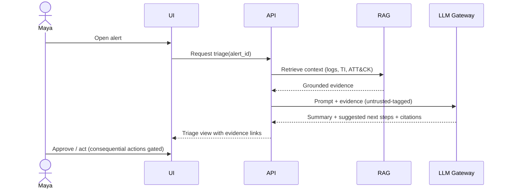

# Use Cases

> **Purpose.** Enumerate the concrete workflows Dula supports, each mapped to a persona,
> maturity, and the roadmap phase that delivers it. Use-case IDs (UC-NN) are stable and
> referenced by tests and roadmap docs.

## Use-Case Catalog

| ID | Use case | Persona | Maturity | Delivered in |
|----|----------|---------|----------|--------------|
| UC-01 | Alert triage & enrichment with grounded summary + next steps | Maya | MVP | Phase 03 |
| UC-02 | NL threat hunting: hypothesis → query (reviewed) → pivot, ATT&CK-mapped | Dev | MVP→FUTURE | Phase 03/07 |
| UC-03 | Incident investigation & timeline drafting | Priya | FUTURE | Phase 06 |
| UC-04 | Detection engineering: draft/tune Sigma & YARA, coverage analysis | Sam | FUTURE | Phase 05/07 |
| UC-05 | CTI: summarize advisories, extract IOCs/TTPs (STIX), correlate | Lin | MVP→FUTURE | Phase 05 |
| UC-06 | Security log analysis & Q&A over logs | Maya/Dev | MVP | Phase 03 |
| UC-07 | Vulnerability analysis: CVE context, prioritization guidance | Dev/Sam | FUTURE | Phase 05 |
| UC-08 | Security tool integration (SIEM/EDR/TI) via connectors | Omar | FUTURE | Phase 07 |
| UC-09 | Automated security reporting (exec + technical) | Priya/Grace | FUTURE | Phase 08 |
| UC-10 | Deploy & operate (incl. air-gapped), RBAC, audit | Omar | MVP | Phase 01/09 |
| UC-11 | Malware analysis assistance (static/behavioral summaries) | Dev | FUTURE/RESEARCH | Phase 05/11 |
| UC-12 | Cloud & Kubernetes security posture assistance | Omar | FUTURE | Phase 07 |
| UC-13 | Digital forensics assistance (artifact interpretation) | Priya | FUTURE | Phase 06 |
| UC-14 | Security knowledge management / grounded Q&A | All | MVP | Phase 03 |
| UC-15 | Security automation playbooks (agent + human approval) | Omar/Priya | FUTURE | Phase 08 |

## Illustrative Flow — UC-01 (Alert Triage)

## Non-Goal Use Cases

Explicitly out of scope: exploit generation, attack automation, unauthorized access
tooling, or evasion for malicious purposes (see
[GuidingPrinciples.md](./GuidingPrinciples.md)).

## Traceability

Each UC has acceptance criteria defined in its delivering roadmap phase
([../04-MVP-Roadmap/](../04-MVP-Roadmap/MVPOverview.md)) and evaluation coverage in
[../15-Testing/AIEvaluation.md](../15-Testing/AIEvaluation.md).
