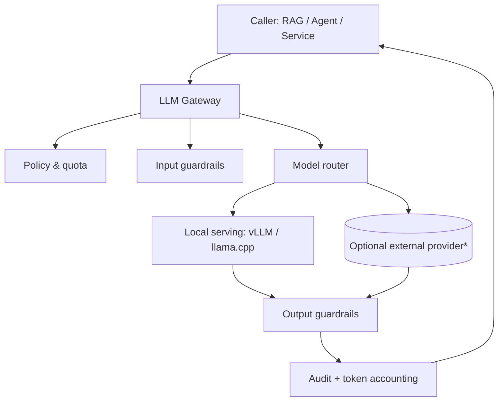
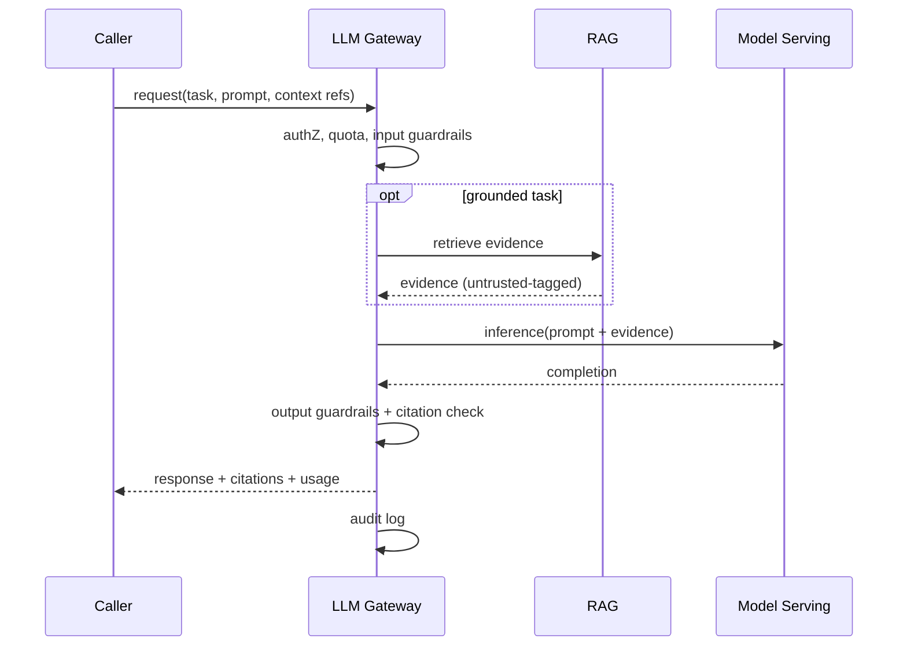

# AI Architecture

> **Purpose.** Define how AI is accessed and controlled across the platform: the LLM
> gateway, model routing, guardrails, and the AI request lifecycle. RAG and agents are
> detailed in sibling documents; this is the spine that connects them to models.

## 1. Principles

- **Model-agnostic:** all AI consumption goes through the **LLM Gateway**; callers never
  bind to a specific model or runtime.
- **Local/offline-capable:** works with self-hosted models (vLLM/llama.cpp), no external
  dependency required.
- **Untrusted by default:** all model output and all retrieved content are treated as
  untrusted (prompt-injection defense — [../10-Security/AIThreatModel.md](../10-Security/AIThreatModel.md)).
- **Grounded & audited:** responses cite evidence; every AI call is logged.

## 2. LLM Gateway

\* External providers are **optional and disabled by default**; unavailable in air-gapped
profiles. See [../11-Deployment/AirGappedDeployment.md](../11-Deployment/AirGappedDeployment.md).

The gateway provides: unified request/response contract, model routing/selection,
input/output guardrails, quotas & rate limits (incl. **per-tenant token/cost budgets**),
token accounting, caching, retries, and audit. It is the single choke point for AI policy.

> **Implementation status (Phase 03, CURRENT).** The gateway (`dula_ai.gateway.LLMGateway`)
> and the AI service (`apps/ai-gateway`) implement: model-agnostic providers (offline
> `extractive-v1` default; Ollama; vLLM/llama.cpp to follow — ADR-0005), per-tenant token
> budgets (429 on exceed), a **per-tenant** response cache (never shared across tenants),
> output secret-redaction, token accounting, and an audit hook (structured log +
> `ai.query.completed` event). API: [../12-API/AIGatewayAPI.md](../12-API/AIGatewayAPI.md).

> **Cross-tenant AI isolation (ADR-0006).** Any caching — prompt cache, KV cache, response
> cache — is **scoped per tenant**; no cache entry is ever shared across tenant boundaries.
> System prompts are treated as **non-secret** (assume they can leak — T13/LLM07), so no
> secrets or policy-criticals are placed in prompts. These are mandatory controls, not
> optimizations. See [../10-Security/AIThreatModel.md](../10-Security/AIThreatModel.md).

## 3. Model Router

- Routes by task, required capability, cost/latency, and deployment profile.
- Supports: general OSS model, **Dula AI** variants, and task-specific small models.
- Selection contract is versioned so callers can pin behavior
  ([../01-Project/ReleaseStrategy.md](../01-Project/ReleaseStrategy.md)).

## 4. Guardrails

- **Input:** prompt-injection heuristics, sensitive-data checks, size/format limits,
  clear separation of trusted instructions from untrusted content.
- **Output:** schema/format validation, policy checks (no secret leakage, safe-content),
  citation enforcement for grounded tasks.
- Guardrail catalog and threat mapping: [../10-Security/AIThreatModel.md](../10-Security/AIThreatModel.md).

## 5. AI Request Lifecycle

## 6. Prompt & Context Management

- Prompt templates are versioned artifacts (not inline strings) with clear trust
  boundaries between system instructions and untrusted content.
- Context assembly (RAG) is separated from instruction assembly to reduce injection risk.

## 7. Relationship to Dula AI

- Dula AI is served behind the gateway like any model; the platform improves as Dula AI
  improves, without platform code changes (see [../02-Vision/ProductStrategy.md](../02-Vision/ProductStrategy.md)).
- Training/eval/serving of Dula AI: [../08-AI/](../08-AI/README.md).

## Related Documents

- [./RAGArchitecture.md](./RAGArchitecture.md) · [./AgentArchitecture.md](./AgentArchitecture.md) ·
  [../08-AI/InferenceArchitecture.md](../08-AI/InferenceArchitecture.md)
