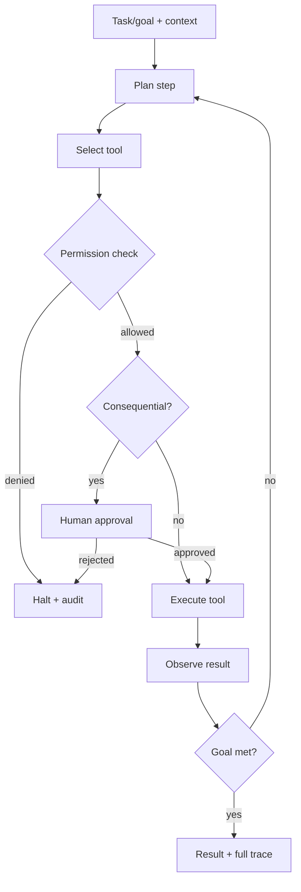

# Agent Architecture

> **Purpose.** Define how AI agents plan and act safely: the runtime, tool calling,
> permissions, human approval, and auditability. Detailed framework docs are in
> [../13-Agents/](../13-Agents/README.md).

## 1. Definition & Scope

An **agent** is an LLM-driven component that, under explicit policy, plans and executes
steps using **permissioned tools** to accomplish a security task (triage, hunt, IR
assist). Agents are **FUTURE** (Phase 06) and are built only after tools, permissions, and
approval controls are proven.

## 2. Runtime Model

- **DECIDED (ADR-0008, Accepted):** **build on LangGraph** for the graph-based plan/act
  loop, checkpointing, and human-in-the-loop pause/resume, and implement the
  security-critical layer (permission checks, approval broker, audit, step/loop/time/cost
  limits) as **first-party Dula code**. This de-risks delivery while keeping security
  controls owned and testable. See [../adr/ADR-0008-agent-runtime.md](../adr/ADR-0008-agent-runtime.md).

## 3. Tool Calling

- Tools are typed, declared capabilities (e.g. `search_logs`, `enrich_indicator`,
  `create_ticket`). See [../13-Agents/ToolCalling.md](../13-Agents/ToolCalling.md).
- Only the `agent-runtime` executes tools; every call passes a permission check.
- Tool inputs/outputs are validated; outputs are treated as untrusted evidence.

## 4. Permissions & Least Privilege

- Each agent runs with a scoped permission set (which tools, which data, which tenant).
- Permissions derive from the invoking user's authorization (no privilege escalation) —
  [../13-Agents/AgentPermissions.md](../13-Agents/AgentPermissions.md),
  [../10-Security/AgentSecurity.md](../10-Security/AgentSecurity.md).

## 5. Human-in-the-Loop

- Consequential/irreversible actions (writes to external systems, containment actions)
  require explicit human approval by default
  ([../13-Agents/HumanApproval.md](../13-Agents/HumanApproval.md)).
- Approval requests carry the plan, the exact action, and predicted impact.

## 6. Safety & Isolation

- Agents run in isolated execution contexts; tool side effects are constrained by
  connector sandboxing ([../14-Plugins/PluginSecurity.md](../14-Plugins/PluginSecurity.md)).
- Loop/step/time/cost limits prevent runaway agents.
- Full trace (plan, tools, inputs, outputs, approvals) is audited and replayable.

## 7. Evaluation

- Agents are evaluated on task success, safety (no unauthorized actions), and efficiency
  ([../15-Testing/AgentEvaluation.md](../15-Testing/AgentEvaluation.md)).

## Related Documents

- [../13-Agents/AgentFramework.md](../13-Agents/AgentFramework.md) ·
  [../10-Security/AgentSecurity.md](../10-Security/AgentSecurity.md) ·
  [./AIArchitecture.md](./AIArchitecture.md)
