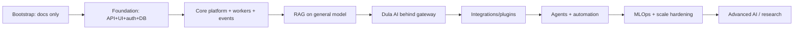

# Architecture Roadmap

> **Purpose.** Describe how the architecture evolves alongside the delivery roadmap, so
> early choices don't paint us into corners and later complexity is added only when
> justified. Pairs with [../04-MVP-Roadmap/MVPOverview.md](../04-MVP-Roadmap/MVPOverview.md).

## 1. Evolution Principle

The **target architecture is production-grade and permanent** (Qdrant, OpenSearch,
Redpanda, etc. — see [../01-Project/TechnologyStack.md](../01-Project/TechnologyStack.md)).
Components are **introduced** at the phase where their capability is first needed — not
swapped in later as replacements for interim substitutes. "Introduced" below means "stood
up in its permanent form"; it does not imply a migration from a placeholder.

## 2. Staged Architecture

## 3. Component Introduction Schedule

| Component (permanent form) | Introduced | Why then |
|----------------------------|------------|----------|
| PostgreSQL, Redis | Phase 01 | baseline |
| Redpanda (Kafka API) event backbone | Phase 02 | async ingestion/enrichment begins |
| Qdrant (vector store) | Phase 03 | RAG begins |
| OpenSearch (BM25 + log-analytics) | Phase 03 | hybrid retrieval begins |
| LLM gateway + local serving | Phase 03 | first AI feature |
| Dula AI serving | Phase 04 | first tuned model passes eval |
| Plugin host | Phase 07 | first external integration |
| Agent runtime | Phase 06 | tools + approvals proven |
| Full MLOps (MLflow/DVC/Argo) | Phase 04→10 | model iteration cadence rises |
| GPU serving pools + autoscale | Phase 09/10 | inference load |

## 4. Avoiding Lock-In / Reversibility

- Vector store, event bus, and model runtime are behind abstractions so they can be
  swapped per their ADRs.
- Model-agnostic gateway prevents coupling to any single model.
- Deployment via Helm profiles keeps cloud/on-prem/air-gapped reversible.

## 5. Scaling Path

- Stateless services scale horizontally first; data tier scaled/partitioned as volume
  grows; model serving scaled independently on GPU pools.
- Performance targets and load testing: [../15-Testing/PerformanceTesting.md](../15-Testing/PerformanceTesting.md).

## 6. Known Architectural Risks (tracked)

See consolidated risks in [../PROJECT_CONTEXT.md](../PROJECT_CONTEXT.md) and the Bootstrap
Report. Highlights: ingestion throughput on Python, GPU availability in air-gapped
installs, RAG poisoning, and agent safety.

## Related Documents

- [../04-MVP-Roadmap/MVPOverview.md](../04-MVP-Roadmap/MVPOverview.md) ·
  [./SystemArchitecture.md](./SystemArchitecture.md)
