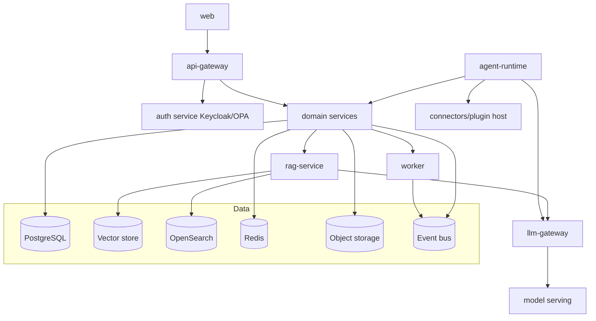

# Component Architecture

> **Purpose.** Describe the major components (services), their responsibilities, and the
> contracts between them. Maps to the repo layout in
> [../01-Project/ProjectStructure.md](../01-Project/ProjectStructure.md).

## 1. Component Map

## 2. Components & Responsibilities

| Component | Responsibility | Key deps |
|-----------|----------------|----------|
| `web` | UI (Next.js); no business logic | api-gateway |
| `api-gateway` | Edge routing, authN check, rate limit, request validation | Keycloak, OPA |
| `auth` (Keycloak + OPA) | Identity, tokens, policy decisions | — |
| Domain services | Alerts, incidents, TI, detections, assets, reports | Postgres, Redis, bus |
| `rag-service` | Indexing, retrieval (hybrid), context assembly | Vector store, OpenSearch, llm-gateway |
| `llm-gateway` | Model-agnostic inference, routing, guardrails, token accounting | Model serving |
| `agent-runtime` | Plan/act loop, tool calling, approvals, audit | Domain svcs, connectors, llm-gateway |
| `worker` | Async ingestion, enrichment, agent execution, pipelines | Event bus, datastores |
| `connectors`/plugin host | Sandboxed integrations to external tools | Plugin SDK |
| Model serving | vLLM/llama.cpp inference | Model registry |

## 3. Contracts Between Components

- Synchronous: REST/gRPC defined by OpenAPI/proto in `packages/contracts`
  ([../12-API/README.md](../12-API/README.md)).
- Asynchronous: events on the bus named `domain.entity.action`
  ([./DataArchitecture.md](./DataArchitecture.md)).
- All inter-service calls are authenticated (service identity) and authorized; no
  implicit trust between components (see [./SecurityArchitecture.md](./SecurityArchitecture.md)).

## 4. Component Boundaries & Ownership

- Each domain service owns its data (no shared tables across services); cross-service data
  access is via API or events, not the database.
- The `llm-gateway` is the **only** path to models — no service calls model serving
  directly. This centralizes guardrails, quotas, routing, and audit.
- The `agent-runtime` is the **only** component that executes tools/connectors, enforcing
  permissions and approvals ([../13-Agents/AgentPermissions.md](../13-Agents/AgentPermissions.md)).

## 5. Failure Isolation

- Components degrade independently: if model serving is unavailable, non-AI features keep
  working; RAG can serve retrieval without generation; agents pause pending tools.
- Circuit breakers, timeouts, and bulkheads on all cross-service calls
  ([../16-Operations/OperationalRunbooks.md](../16-Operations/OperationalRunbooks.md)).

## Related Documents

- [../05-Backend/ServiceArchitecture.md](../05-Backend/ServiceArchitecture.md) ·
  [./IntegrationArchitecture.md](./IntegrationArchitecture.md)
