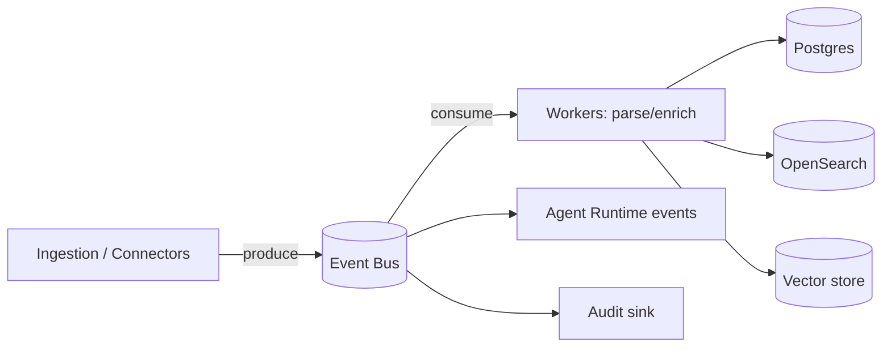
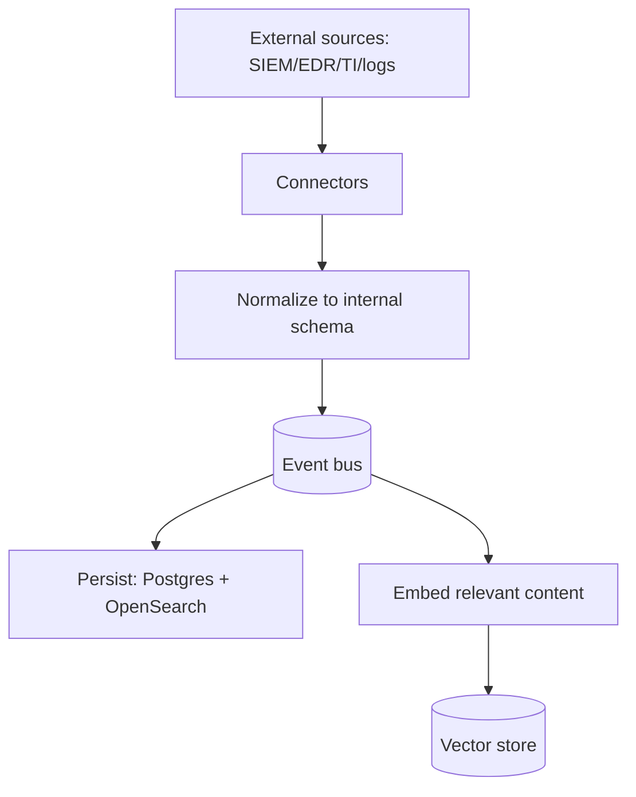

# Data Architecture

> **Purpose.** Define how data is stored, moved, and processed across the platform: the
> datastores and their roles, the event backbone, and data flow for ingestion and AI.

## 1. Datastore Roles (Polyglot Persistence)

| Store | Role | Notes |
|-------|------|-------|
| PostgreSQL 16 | System of record: tenants, users, alerts, incidents, detections, audit | RLS for tenant isolation |
| Qdrant | Embeddings for RAG (standard vector store) | ADR-0003 |
| OpenSearch | Full-text/BM25 + security-log analytics | Hybrid search partner to Qdrant |
| Redis | Cache, rate limiting, ephemeral state, queues | Not a system of record |
| Object storage (MinIO/S3) | Files, artifacts, datasets, model blobs, reports | Air-gap: MinIO |
| Event & streaming backbone (Redpanda, Kafka API) | Async events & high-volume telemetry ingestion + replay | ADR-0004 |

Each domain service owns its schema; there is no cross-service shared table.

## 2. Event Backbone

- Backbone: **Redpanda (Kafka API)** — durable streaming, replay, and consumer groups for
  SIEM-scale telemetry (ADR-0004). Apache Kafka is an accepted drop-in equivalent.
- Event naming: `domain.entity.action` (see [../00-Governance/NamingConventions.md](../00-Governance/NamingConventions.md)).
- At-least-once delivery; consumers are idempotent (dedupe by event id).

## 3. Ingestion Data Flow (High Level)

- Normalization maps external formats to internal models (aligning to open schemas such
  as OCSF/ECS is **REQUIRES RESEARCH** — see [../07-Database/DataModel.md](../07-Database/DataModel.md)).
- Only content approved for retrieval is embedded (governance in
  [../08-AI/DataPipeline.md](../08-AI/DataPipeline.md)).

## 4. Data Classification & Tenancy

- Every record carries `tenant_id`; classification levels (public/internal/sensitive)
  drive encryption, retention, and RAG-eligibility. See
  [../10-Security/DataSecurity.md](../10-Security/DataSecurity.md).
- Tenant data is isolated at DB (RLS), index (namespace), and object-prefix levels.

## 5. Retention & Lifecycle

- Retention policies per data class and per tenant (configurable), enforced by lifecycle
  jobs. Audit data has its own, longer retention.
- Backups and DR per [../16-Operations/BackupRecovery.md](../16-Operations/BackupRecovery.md)
  and [../11-Deployment/DisasterRecovery.md](../11-Deployment/DisasterRecovery.md).

## 6. Data Lineage

- Ingested → normalized → stored → embedded transitions are traceable; dataset/model
  lineage covered in [../09-MLOps/DatasetVersioning.md](../09-MLOps/DatasetVersioning.md).

## Related Documents

- [../07-Database/DataModel.md](../07-Database/DataModel.md) ·
  [./RAGArchitecture.md](./RAGArchitecture.md) ·
  [../08-AI/DataPipeline.md](../08-AI/DataPipeline.md)
