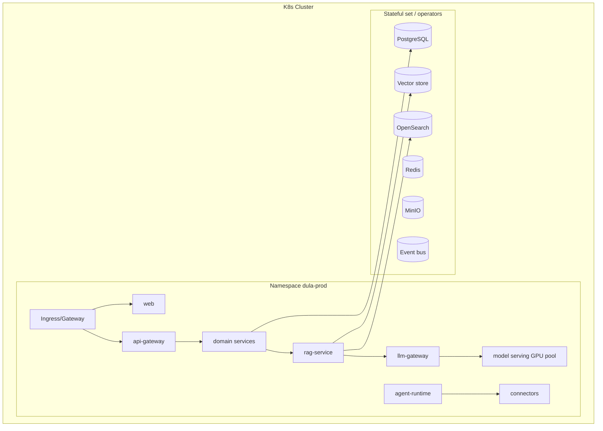

# Deployment Architecture

> **Purpose.** Define how the system is packaged and deployed across profiles from one
> codebase. Operational how-to lives in [../11-Deployment/](../11-Deployment/README.md);
> this is the architectural view.

## 1. Packaging Model

- Every component ships as a signed OCI **container image** + a **Helm chart**.
- An umbrella Helm chart composes the platform; profile differences are expressed as Helm
  **values overlays**, not code branches.
- **Air-gapped** installs use a self-contained offline bundle (images + charts + models +
  SBOM) imported into a private registry.

## 2. Reference Topology (Kubernetes)

- Stateless services autoscale (HPA); model serving uses GPU-aware scheduling.
- Stateful components run via operators or managed equivalents (cloud profile).

## 3. Deployment Profiles

| Profile | Orchestration | Models | External deps | Notes |
|---------|---------------|--------|---------------|-------|
| Dev | Docker Compose | small local (Ollama/llama.cpp) | none | fast inner loop |
| Cloud | K8s + managed data services (optional) | vLLM on GPU nodes | optional | elastic scale |
| On-prem | K8s + self-hosted data | vLLM/llama.cpp | none required | operator-run |
| Hybrid | K8s split control/data | mixed | policy-bound | data stays on-prem |
| Air-gapped | K8s, offline bundle | local only | **none** | private registry, no egress |

Details and trade-offs: [../11-Deployment/README.md](../11-Deployment/README.md).

## 4. Configuration, Secrets, Models

- Config via Helm values + `pydantic-settings` validation at startup.
- Secrets via Vault/SOPS; never in images ([../10-Security/DataSecurity.md](../10-Security/DataSecurity.md)).
- Model artifacts pulled from the model registry / object storage; in air-gapped installs
  they ship in the offline bundle.

## 5. Networking & Trust Zones

- Ingress terminates TLS; internal traffic uses mTLS/service identity.
- Network policies segment planes; egress is default-deny (critical for air-gapped) with
  explicit allowlists where a profile permits it. See
  [./SecurityArchitecture.md](./SecurityArchitecture.md).

## 6. Upgrades, Backup, DR

- Rolling upgrades via Helm/Argo CD; DB migrations forward-only.
- Backup/restore and DR: [../16-Operations/BackupRecovery.md](../16-Operations/BackupRecovery.md),
  [../11-Deployment/DisasterRecovery.md](../11-Deployment/DisasterRecovery.md).

## Related Documents

- [../11-Deployment/KubernetesDeployment.md](../11-Deployment/KubernetesDeployment.md) ·
  [../11-Deployment/AirGappedDeployment.md](../11-Deployment/AirGappedDeployment.md)
