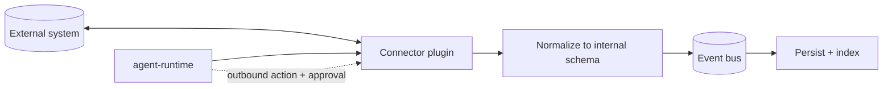

# Integration Architecture

> **Purpose.** Define how Dula connects to the external security ecosystem (SIEM, EDR/XDR,
> TI platforms, ticketing, cloud, Kubernetes) inbound and outbound, safely and portably.

## 1. Integration Patterns

| Pattern | Use | Example |
|---------|-----|---------|
| Inbound ingestion | Pull/receive telemetry & intel | SIEM logs, TI feeds (STIX/TAXII) |
| Outbound action | Take/request action in external system | create ticket, isolate host (gated) |
| Query/enrichment | On-demand lookups | reputation lookup, asset context |
| Bi-directional sync | Keep entities in sync | incidents ↔ ticketing |

All integrations are delivered as **plugins/connectors**
([./PluginArchitecture.md](./PluginArchitecture.md)) so the core stays decoupled and
sandboxed.

## 2. Integration Flow

- Inbound data is normalized to internal schemas
  ([./DataArchitecture.md](./DataArchitecture.md)); alignment to OCSF/ECS is
  **REQUIRES RESEARCH**.
- Outbound consequential actions pass agent permission + human approval
  ([../13-Agents/HumanApproval.md](../13-Agents/HumanApproval.md)).

## 3. Standard Interfaces

- Prefer open standards: **STIX/TAXII** (threat intel), **Sigma** (detections), **YARA**
  (malware), **OpenAPI** (REST), webhooks/events.
- Connector capability contracts: [../14-Plugins/ConnectorStandards.md](../14-Plugins/ConnectorStandards.md).

## 4. Security

- Connectors are sandboxed with scoped credentials and egress allowlists.
- Credentials for external systems stored in Vault, injected at runtime, never logged.
- SSRF and injection risks for outbound calls are mitigated per
  [../10-Security/ThreatModel.md](../10-Security/ThreatModel.md).

## 5. Air-Gapped Integrations

- Only internal-endpoint integrations function air-gapped; external-cloud connectors are
  inert unless an on-prem equivalent endpoint is configured.

## 6. Extensibility

- Third parties can build connectors against the Plugin SDK
  ([../14-Plugins/PluginFramework.md](../14-Plugins/PluginFramework.md)); signed and
  permission-scoped before enablement.

## Related Documents

- [./PluginArchitecture.md](./PluginArchitecture.md) ·
  [../14-Plugins/ConnectorStandards.md](../14-Plugins/ConnectorStandards.md)
