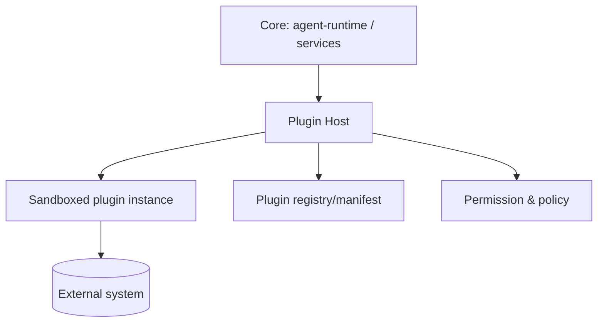

# Plugin Architecture

> **Purpose.** Define the extensibility model: how plugins/connectors integrate external
> security tools safely. Framework detail is in [../14-Plugins/](../14-Plugins/README.md).

## 1. Concepts

- **Plugin** — a packaged, sandboxed extension that provides one or more **connectors**
  and/or **tools**.
- **Connector** — an adapter to an external system (SIEM/EDR/TI), exposing capabilities
  like `splunk.search`, `vt.lookup_hash`.
- **Tool** — a callable capability usable by agents (see
  [../13-Agents/ToolCalling.md](../13-Agents/ToolCalling.md)).

## 2. Plugin Host

- Plugins declare a **manifest**: identity, capabilities, required permissions, network
  egress needs, and resource limits.
- The host enforces permissions, network egress allowlists, and resource limits; plugins
  cannot exceed their declared scope.

## 3. Isolation & Security

- Plugins run **sandboxed** (process/container isolation; **REQUIRES DECISION** on the
  exact sandbox: separate container vs WASM vs subprocess) with default-deny egress.
- Untrusted plugin output is treated as untrusted evidence.
- Full detail: [../14-Plugins/PluginSecurity.md](../14-Plugins/PluginSecurity.md).

## 4. Lifecycle

- Install → verify signature → validate manifest → grant scoped permissions → enable →
  monitor → upgrade/disable/remove. See
  [../14-Plugins/PluginLifecycle.md](../14-Plugins/PluginLifecycle.md).

## 5. Air-Gapped Considerations

- Plugins ship in the offline bundle; those requiring external egress are inert in
  air-gapped installs unless an internal endpoint is configured.

## 6. Standards

- Connector capability naming and contracts:
  [../14-Plugins/ConnectorStandards.md](../14-Plugins/ConnectorStandards.md).

## Related Documents

- [./IntegrationArchitecture.md](./IntegrationArchitecture.md) ·
  [../14-Plugins/PluginFramework.md](../14-Plugins/PluginFramework.md)
