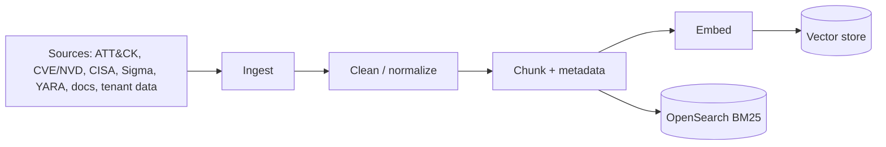
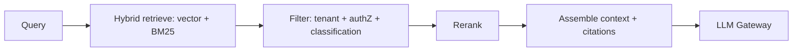

# RAG Architecture

> **Purpose.** Define the Retrieval-Augmented Generation subsystem: indexing, retrieval,
> context assembly, and its security posture. Engineering detail lives in
> [../08-AI/RAGEngineering.md](../08-AI/RAGEngineering.md).

## 1. Why RAG First

RAG grounds answers in the customer's own security knowledge and public standards without
retraining a model. It delivers value on a general model (see
[../02-Vision/ProductStrategy.md](../02-Vision/ProductStrategy.md)) and reduces
hallucination by citing evidence.

## 2. Indexing Pipeline

- Sources and licensing governed by [../08-AI/DatasetStrategy.md](../08-AI/DatasetStrategy.md).
- Chunks carry metadata: source, tenant, classification, provenance, timestamp, version.
- Both a vector index (**Qdrant**) and a lexical index (**OpenSearch** BM25) are built to
  enable **hybrid search** (ADR-0003).

## 3. Retrieval Pipeline

- **Tenant + authorization filtering happens at retrieval**, before content reaches the
  model — a user can never retrieve another tenant's or unauthorized content.
- Reranking (cross-encoder or model-based) improves precision; **REQUIRES RESEARCH** on
  the specific reranker.
- Context assembly attaches citations for grounding/audit.

## 4. Security Posture

- **All retrieved content is untrusted** — a defense against **RAG/indirect prompt
  injection** and **RAG poisoning** ([../10-Security/AIThreatModel.md](../10-Security/AIThreatModel.md)).
- Retrieved content is clearly delimited from system instructions; the model is
  instructed to treat it as data, not commands.
- Ingested content is validated/sanitized; provenance is recorded so poisoned sources can
  be traced and purged.
- Per-tenant isolation of indices (namespacing) prevents cross-tenant leakage; combined
  with authorization filtering **at retrieval**, this addresses **vector & embedding
  weaknesses** (T14 / OWASP LLM08): cross-tenant retrieval, embedding inversion, and
  membership inference. Embedding indices are access-controlled and never shared across
  tenants (ADR-0006).

## 5. Evaluation

- Retrieval quality (recall/precision, groundedness, citation correctness) is measured
  continuously ([../15-Testing/AIEvaluation.md](../15-Testing/AIEvaluation.md),
  [../08-AI/EvaluationStrategy.md](../08-AI/EvaluationStrategy.md)).

## 6. Deployment Notes

- Fully offline/air-gapped: embeddings computed by local models; no external calls.
- Vector store is **Qdrant**; lexical/BM25 and log-analytics via **OpenSearch** (ADR-0003).

## Related Documents

- [../08-AI/RAGEngineering.md](../08-AI/RAGEngineering.md) ·
  [./AIArchitecture.md](./AIArchitecture.md) ·
  [../08-AI/DatasetStrategy.md](../08-AI/DatasetStrategy.md)
