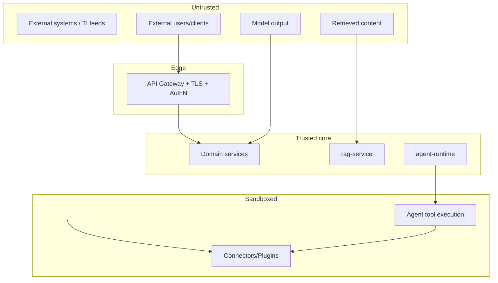

# Security Architecture

> **Purpose.** Define the trust boundaries, identity, authorization, isolation, secrets,
> encryption, and audit model that make Dula safe to run — appropriate for a
> cybersecurity product handling highly sensitive data. Threat detail is in
> [../10-Security/](../10-Security/README.md).

## 1. Trust Boundaries

Key boundaries: external clients ↔ edge; core ↔ sandboxed plugins/agent tools; and the
**AI trust boundary** — *all model output and retrieved content is untrusted*.

## 2. Identity & Authentication

- Human identity via Keycloak/OIDC; JWT access tokens with short lifetimes.
- Service identity via workload identity + mTLS; no implicit inter-service trust.
- MFA supported; federation for enterprise IdPs. See
  [../12-API/Authentication.md](../12-API/Authentication.md).

## 3. Authorization (RBAC + ABAC)

- Externalized policy in OPA/Rego; decisions consider role, tenant, resource attributes,
  and data classification.
- Enforced at the service layer (not just UI) and at RAG retrieval time.
- Details: [../12-API/Authorization.md](../12-API/Authorization.md).

## 4. Least Privilege & Isolation

- Agents/plugins run with minimal, scoped permissions; sandboxed execution; default-deny
  egress ([../14-Plugins/PluginSecurity.md](../14-Plugins/PluginSecurity.md),
  [../10-Security/AgentSecurity.md](../10-Security/AgentSecurity.md)).
- Tenant isolation is defense-in-depth (app scope + DB RLS + index namespacing).
- Network policies segment planes; secrets scoped per component.

## 5. Secrets & Encryption

- Secrets in Vault; GitOps secrets via SOPS; never in code/images.
- Encryption in transit (TLS/mTLS) and at rest (DB/object storage); key management per
  [../10-Security/DataSecurity.md](../10-Security/DataSecurity.md).

## 6. AI-Specific Security

- Prompt-injection (direct & indirect), RAG/data poisoning, model extraction/theft, tool
  abuse, agent privilege escalation are addressed in
  [../10-Security/AIThreatModel.md](../10-Security/AIThreatModel.md) and enforced via the
  LLM gateway guardrails ([./AIArchitecture.md](./AIArchitecture.md)).

## 7. Audit & Monitoring

- Every authN/authZ decision, AI call, and tool execution is audited (immutable,
  tenant-scoped). Security monitoring/alerting in
  [../16-Operations/Monitoring.md](../16-Operations/Monitoring.md).

## 8. Supply Chain

- Signed images, SBOMs, provenance, dependency/secret scanning
  ([../10-Security/SupplyChainSecurity.md](../10-Security/SupplyChainSecurity.md)).

## Related Documents

- [../10-Security/ThreatModel.md](../10-Security/ThreatModel.md) ·
  [../10-Security/AIThreatModel.md](../10-Security/AIThreatModel.md) ·
  [../12-API/Authorization.md](../12-API/Authorization.md)
