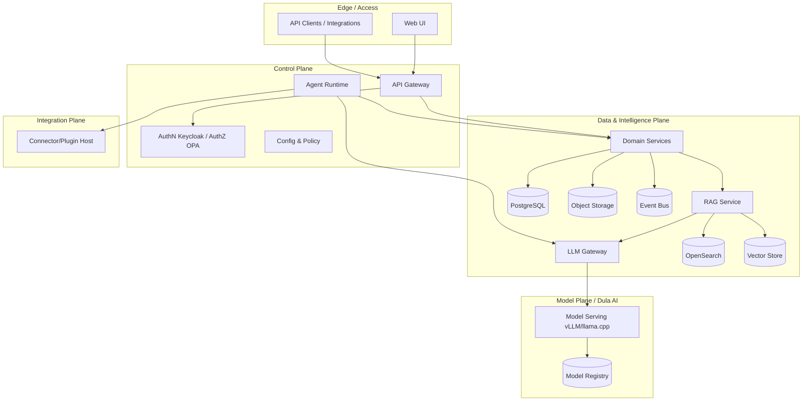
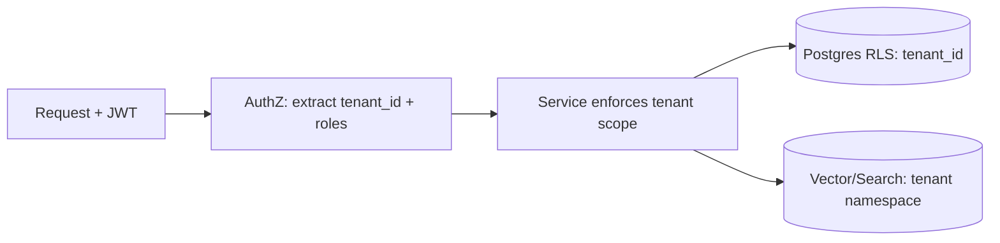

# System Architecture

> **Purpose.** Define the high-level architecture of the Dula ecosystem: major planes,
> how they interact, multi-tenancy, and the cross-cutting concerns. Detailed component,
> data, AI, RAG, agent, plugin, deployment, and security views live in sibling documents.
> **Status: MVP/FUTURE** — no implementation exists yet.

## 1. Architectural Goals & Constraints

- Deploy-anywhere (cloud/on-prem/hybrid/**air-gapped**) from one codebase.
- Two independently deployable products sharing versioned contracts.
- Security-first: least privilege, isolation, auditability, untrusted-content handling.
- Model-agnostic AI access; local/offline inference supported.
- Horizontally scalable stateless services; clear data ownership.

## 2. Logical Planes

*Diagram: logical planes and primary interactions.*

## 3. Plane Responsibilities

- **Edge/Access:** UI and API/integration clients; TLS termination; rate limiting.
- **Control Plane:** API gateway, authentication (Keycloak/OIDC), authorization (OPA),
  agent orchestration, configuration/policy.
- **Data & Intelligence Plane:** domain services (incidents, alerts, TI, detections),
  RAG service, LLM gateway, and the datastores (Postgres, vector store, OpenSearch,
  object storage) plus the event bus.
- **Model Plane (Dula AI):** model serving and registry; consumed only through the LLM
  gateway.
- **Integration Plane:** sandboxed connector/plugin host for external security tools.

## 4. Multi-Tenancy

> **DECIDED (ADR-0006, Accepted).** **Shared services with strong logical isolation** — a
> `tenant_id` on every tenant-scoped row, enforced by PostgreSQL Row-Level Security and by
> an authorization layer (OPA) that injects tenant scope; vector and search indices are
> namespaced per tenant; object storage prefixes per tenant. High-assurance customers can
> opt into **dedicated-instance** isolation (separate namespace/DB/serving) via deployment
> profile.
>
> **AI-layer isolation is mandatory:** no prompt/KV/response cache is shared across tenant
> boundaries, and embeddings/retrieval are tenant-namespaced and authorization-filtered at
> retrieval time (addresses OWASP LLM08 — see
> [../10-Security/AIThreatModel.md](../10-Security/AIThreatModel.md) and
> [../adr/ADR-0006-multi-tenancy.md](../adr/ADR-0006-multi-tenancy.md)).

Isolation is defense-in-depth: application scope + database RLS + index namespacing, so a
single missed check does not cross tenant boundaries.

## 5. Cross-Cutting Concerns

| Concern | Approach | Reference |
|---------|----------|-----------|
| AuthN | Keycloak / OIDC, JWT | [../12-API/Authentication.md](../12-API/Authentication.md) |
| AuthZ | RBAC + ABAC via OPA | [../12-API/Authorization.md](../12-API/Authorization.md) |
| Config | 12-factor, per-profile Helm values | [../01-Project/TechnologyStack.md](../01-Project/TechnologyStack.md) |
| Events & streaming | Redpanda (Kafka API) | [./DataArchitecture.md](./DataArchitecture.md) |
| Observability | OTel + Prom/Grafana/Loki/Tempo | [../16-Operations/Observability.md](../16-Operations/Observability.md) |
| Security | trust boundaries, isolation, audit | [./SecurityArchitecture.md](./SecurityArchitecture.md) |
| AI access | model-agnostic gateway | [./AIArchitecture.md](./AIArchitecture.md) |

## 6. Statefulness & Scaling

- Services are **stateless** and horizontally scalable; all state lives in datastores.
- Long-running work (ingestion, enrichment, agent runs) is asynchronous via the event bus
  and workers.
- Model serving scales separately (GPU-aware) from the rest of the platform.

## 7. Key Architectural Decisions (ADR candidates)

See the ADR backlog in
[../00-Governance/ArchitectureDecisionRecords.md](../00-Governance/ArchitectureDecisionRecords.md).
Decisions with system-wide impact: multi-tenancy model (ADR-0006), event backbone
(ADR-0004), vector store (ADR-0003), serving runtime (ADR-0005).

## Related Documents

- [./ComponentArchitecture.md](./ComponentArchitecture.md) ·
  [./DeploymentArchitecture.md](./DeploymentArchitecture.md) ·
  [./DataArchitecture.md](./DataArchitecture.md) ·
  [./SecurityArchitecture.md](./SecurityArchitecture.md)
