# MVP Roadmap — Overview

> **Purpose.** Define the incremental path from an **empty repository** to a
> **production-ready platform** and an **advanced Dula AI**. Each phase delivers verifiable
> value and de-risks the next. **No milestone is implemented during bootstrap.**

## 1. Milestone Naming

- **M000** = this Documentation Bootstrap (current).
- **M001+** map to the phases below; issues link to milestones and to
  [../PROJECT_STATE.md](../PROJECT_STATE.md).

## 2. Phase Map

```mermaid
flowchart LR
    M0[M000 Docs] --> P1[P01 Foundation]
    P1 --> P2[P02 Core Platform]
    P2 --> P3[P03 Knowledge/RAG]
    P3 --> P4[P04 Dula AI]
    P4 --> P5[P05 Cyber Intelligence]
    P5 --> P6[P06 Agents]
    P6 --> P7[P07 Integrations]
    P7 --> P8[P08 Automation]
    P8 --> P9[P09 Production]
    P9 --> P10[P10 MLOps]
    P10 --> P11[P11 Advanced AI]
```

> Phases are **logically ordered**, not strictly serial — some overlap (e.g. MLOps
> foundations begin during P04). The order encodes dependencies, not a Gantt chart.

## 3. Phases at a Glance

| Phase | Theme | Primary outcome | First usable MVP? |
|-------|-------|-----------------|-------------------|
| [P01](./Phase01-Foundation.md) | Foundation | Repo, CI, scaffolding, auth, DB | — |
| [P02](./Phase02-CorePlatform.md) | Core platform | Core domain services, UI shell, events | — |
| [P03](./Phase03-KnowledgeRAG.md) | Knowledge/RAG | Grounded Q&A + triage on general model | **✅ First usable MVP** |
| [P04](./Phase04-DulaAI.md) | Dula AI | Tuned model behind gateway, eval-gated | — |
| [P05](./Phase05-CyberIntelligence.md) | Cyber intel | CTI/vuln/detection assistance | — |
| [P06](./Phase06-Agents.md) | Agents | Safe agents w/ approvals | — |
| [P07](./Phase07-Integrations.md) | Integrations | Plugins/connectors | — |
| [P08](./Phase08-Automation.md) | Automation | Playbooks, reporting | — |
| [P09](./Phase09-Production.md) | Production | Hardening, all deploy profiles, GA | **✅ Production-ready** |
| [P10](./Phase10-MLOps.md) | MLOps | Full model lifecycle at scale | — |
| [P11](./Phase11-AdvancedAI.md) | Advanced AI | Research directions | **Advanced Dula AI** |

## 4. Standard Milestone Template

Every phase document uses this structure (per project instruction):
**Objective · Scope · Dependencies · Deliverables · Implementation requirements · Tests ·
Security requirements · Documentation · Acceptance criteria · Definition of Done.**

## 5. Definition of Done (Global)

A phase is Done when all its deliverables meet acceptance criteria, tests + security gates
pass, docs are updated, and it deploys across the profiles it targets (including a viable
air-gapped path where applicable). Global DoD is inherited by every phase unless
tightened.

## 6. Estimates

- No calendar dates or effort estimates are asserted (**REQUIRES DECISION** by the team);
  sequencing and dependencies are the durable content here.

## Related Documents

- [../03-Architecture/ArchitectureRoadmap.md](../03-Architecture/ArchitectureRoadmap.md) ·
  [../08-AI/DulaAIStrategy.md](../08-AI/DulaAIStrategy.md)
