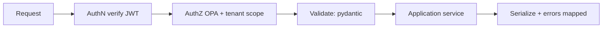

# Backend API Architecture

> **Purpose.** How services expose and consume APIs. API *standards* (contracts, versioning,
> auth) live in [../12-API/](../12-API/README.md); this is the backend implementation view.

## 1. External vs Internal APIs

- **External** (client-facing): REST/OpenAPI through the api-gateway; streaming via SSE/
  WebSocket for AI responses.
- **Internal** (service-to-service): REST or gRPC defined by shared contracts; not exposed
  publicly.

## 2. Contract-First

- Contracts (OpenAPI/proto) in `packages/contracts` are the source of truth; server stubs
  and typed clients (incl. the frontend client) are generated
  ([../12-API/README.md](../12-API/README.md)).

## 3. Request Lifecycle

## 4. Validation & Errors

- Pydantic models validate all input; typed domain errors mapped to consistent HTTP
  problem responses; no stack traces/secrets leaked.

## 5. Streaming

- AI/agent endpoints stream tokens/events (SSE) for responsiveness
  ([../08-AI/InferenceArchitecture.md](../08-AI/InferenceArchitecture.md)).

## 6. Pagination, Filtering, Rate Limits

- Consistent pagination/filtering conventions; rate limits/quotas at the gateway
  ([../12-API/README.md](../12-API/README.md)).
