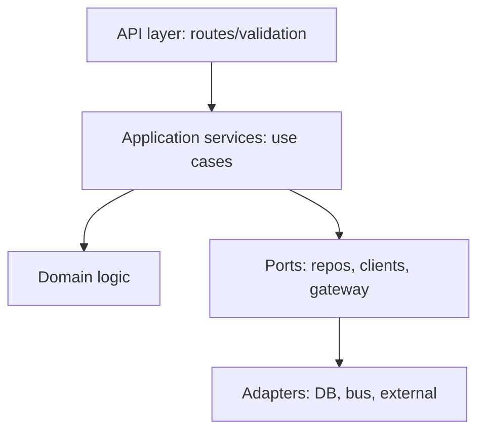

# Service Architecture

> **Purpose.** Define how backend services are designed: boundaries, layering, data
> ownership, and communication.

## 1. Service Boundaries

- Services align to bounded contexts (alerts, incidents, threat-intel, detections, assets,
  reports, rag, llm-gateway, agent-runtime) — see
  [../03-Architecture/ComponentArchitecture.md](../03-Architecture/ComponentArchitecture.md).
- Each service **owns its data**; no shared tables. Cross-service access via API/events.

## 2. Internal Layering

- Route handlers are thin; business logic lives in application/domain layers (ports &
  adapters). This keeps logic testable and infra swappable.

## 3. Communication

- **Sync:** REST/gRPC via contracts in `packages/contracts` ([./APIArchitecture.md](./APIArchitecture.md)).
- **Async:** events on the bus (`domain.entity.action`); consumers idempotent
  ([../03-Architecture/DataArchitecture.md](../03-Architecture/DataArchitecture.md)).
- All inter-service calls authenticated (service identity) and authorized.

## 4. Cross-Cutting

- AuthZ (OPA), tenant scoping, structured logging, tracing (OTel), config validation, and
  error mapping are provided by shared middleware/libraries (`packages/common-py`).

## 5. Resilience

- Timeouts, retries with backoff, circuit breakers, and bulkheads on external/inter-service
  calls; graceful degradation when AI/model serving is down
  ([../03-Architecture/ComponentArchitecture.md](../03-Architecture/ComponentArchitecture.md) §5).

## 6. Statelessness

- Services are stateless; all state in datastores; safe to scale horizontally.
