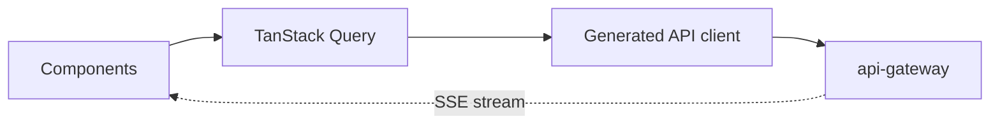

# Frontend Architecture

> **Purpose.** Define the UI application's structure, data flow, and streaming/AI UX.

## 1. Framework & Rendering

- **Next.js App Router**; Server Components by default, Client Components where
  interactivity is needed. Self-hostable/offline build for air-gapped installs.

## 2. Data Flow

- Server state via TanStack Query; the API client is generated from OpenAPI (no
  hand-written fetch for typed endpoints).
- **No business logic in the UI** — the API is authoritative (incl. authZ).

## 3. Streaming AI UX

- Chat/agent/triage views stream tokens/events via SSE for responsiveness
  ([../08-AI/InferenceArchitecture.md](../08-AI/InferenceArchitecture.md)); show evidence
  citations and clearly indicate AI-generated content.

## 4. Auth

- OIDC login via Keycloak; tokens handled securely; UI enforces *display* gating but never
  relies on it for security ([../12-API/Authentication.md](../12-API/Authentication.md)).

## 5. Structure

- Feature-based modules; shared UI primitives; strict TypeScript; naming per
  [../00-Governance/NamingConventions.md](../00-Governance/NamingConventions.md).

## 6. Accessibility & Theming

- WCAG-minded components; light/dark; see [./UIUXGuidelines.md](./UIUXGuidelines.md).

## 7. Testing

- `vitest` + Testing Library; Playwright E2E
  ([../15-Testing/TestingStrategy.md](../15-Testing/TestingStrategy.md)).
