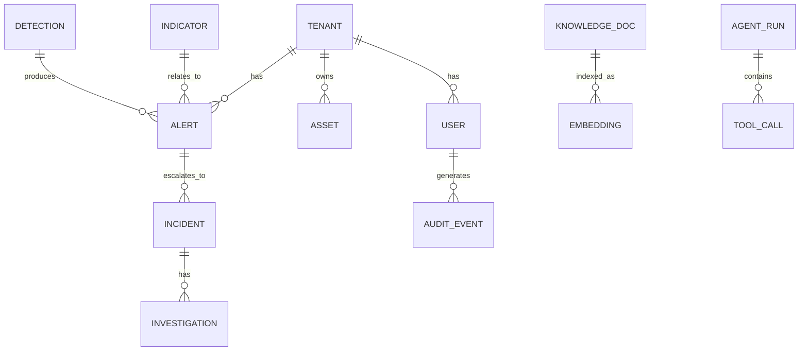

# Data Model

> **Purpose.** Define the core conceptual entities and relationships. This is a
> **conceptual** model; concrete schemas are delivered per phase via migrations. Alignment
> to open schemas (OCSF/ECS/STIX) is **REQUIRES RESEARCH**.

## 1. Core Entities (Conceptual)

## 2. Entity Notes

- **Tenant/User:** tenancy + identity; every tenant-scoped row carries `tenant_id`.
- **Asset:** monitored entities (hosts, accounts, cloud/K8s resources).
- **Alert/Incident/Investigation:** the SOC/IR workflow spine.
- **Indicator (IOC/IOA):** threat-intel entities; map to STIX where applicable.
- **Detection:** Sigma/YARA/custom rules that produce alerts.
- **Knowledge doc/Embedding:** RAG corpus + vectors (per-tenant + shared public).
- **Agent run/Tool call:** agent execution records for audit
  ([../13-Agents/AgentLifecycle.md](../13-Agents/AgentLifecycle.md)).
- **Audit event:** immutable audit trail ([../10-Security/DataSecurity.md](../10-Security/DataSecurity.md)).

## 2a. Implementation Status (CURRENT)

Delivered per phase via migrations (`apps/platform-api/alembic/versions/`):

- **Phase 01 (`0001_initial`):** `tenants`, `users` (+ RLS on `users`).
- **Phase 02 (`0002_domain_spine`):** `assets`, `incidents`, `alerts` (soft-deletable,
  tenant-scoped) and append-only `audit_events`. RLS enabled with a
  `<table>_tenant_isolation` policy on every tenant table. Alerts optionally link to an
  asset and an incident (`ON DELETE SET NULL`). API surface:
  [../12-API/CoreDomainAPI.md](../12-API/CoreDomainAPI.md).

Entities in §1 not listed above (Indicator, Detection, Knowledge doc, Embedding, Agent run,
Tool call) remain **FUTURE** and arrive in their delivering phases.

## 3. Conventions

- `id`, `tenant_id`, `created_at`, `updated_at`, `deleted_at`; naming per
  [../00-Governance/NamingConventions.md](../00-Governance/NamingConventions.md) §5.
- Soft delete where audit/history matters; hard delete for retention compliance.

## 4. Standards Alignment (REQUIRES RESEARCH)

- Evaluate **OCSF/ECS** for events/logs and **STIX** for threat intel to ease integration
  ([../03-Architecture/IntegrationArchitecture.md](../03-Architecture/IntegrationArchitecture.md)).

## 5. Classification

- Entities/fields carry data classification driving encryption/retention/RAG-eligibility
  ([../10-Security/DataSecurity.md](../10-Security/DataSecurity.md)).
