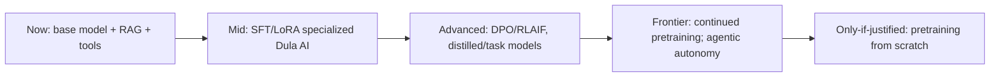

# AI Research Roadmap

> **Purpose.** Frame the longer-term, higher-risk AI directions (RESEARCH/EXPERIMENTAL),
> with the trigger conditions that would justify pursuing them. Nothing here is committed.

## 1. Horizon Model

## 2. Research Themes & Triggers

| Theme | Description | Trigger to pursue | Maturity |
|-------|-------------|-------------------|----------|
| Preference optimization | DPO/RLAIF to align outputs | SFT/LoRA plateau measured | RESEARCH |
| Distillation | Small fast models from large | Need small model at quality | RESEARCH |
| Task-specialized models | Classify/extract/detect models | High-volume narrow task | RESEARCH |
| Continued pretraining | Domain corpus pretraining | Clear ceiling from adaptation | RESEARCH |
| Advanced agentic autonomy | Longer autonomous chains (still supervised) | Safety controls proven at scale | RESEARCH |
| Multimodal (e.g. artifacts) | Beyond text | Concrete UC demand | EXPERIMENTAL |
| From-scratch pretraining | Own base model | Licensing/sovereignty unmet otherwise; funded | RESEARCH (likely never) |

## 3. Guardrails on Research

- Every research direction still passes the evaluation + safety gates before any
  production use ([./EvaluationStrategy.md](./EvaluationStrategy.md)).
- Research artifacts are quarantined from production until promoted.
- Dual-use safety review is mandatory for any capability increase
  ([../10-Security/AIThreatModel.md](../10-Security/AIThreatModel.md)).

## 4. Relationship to Delivery Roadmap

- These map primarily to Phase 11 ([../04-MVP-Roadmap/Phase11-AdvancedAI.md](../04-MVP-Roadmap/Phase11-AdvancedAI.md))
  and are pursued only after the platform + MLOps foundation is solid.

## Related Documents

- [./DulaAIStrategy.md](./DulaAIStrategy.md) · [../03-Architecture/ArchitectureRoadmap.md](../03-Architecture/ArchitectureRoadmap.md)
