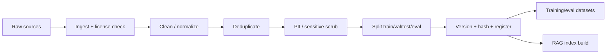

# Data Pipeline (AI)

> **Purpose.** Define the pipeline that turns raw sources into versioned datasets for
> training/eval and into indexed content for RAG.

## 1. Pipeline Stages

## 2. Stage Details

- **Ingest + license check:** reject sources failing the license gate
  ([../01-Project/Dependencies.md](../01-Project/Dependencies.md)); record provenance.
- **Clean/normalize:** strip boilerplate, normalize encodings/formats, standardize
  security identifiers (ATT&CK IDs, CVE IDs).
- **Deduplicate:** exact + near-duplicate removal to prevent overfitting and eval leakage.
- **PII/sensitive scrub:** de-identify telemetry; block secrets/credentials.
- **Split:** maintain an isolated eval set (never trained on).
- **Version/register:** immutable dataset versions via DVC + registry
  ([../09-MLOps/DatasetVersioning.md](../09-MLOps/DatasetVersioning.md)).

## 3. RAG Indexing Branch

- Chunking + metadata + embedding + dual index (vector + BM25) —
  see [./RAGEngineering.md](./RAGEngineering.md) and
  [../03-Architecture/RAGArchitecture.md](../03-Architecture/RAGArchitecture.md).

## 4. Reproducibility

- Pipelines are code (in `ml/datasets`), parameterized by config, run in tracked pipeline
  jobs; each dataset version links to the exact pipeline run/commit.

## 5. Quality Checks

- Automated checks: schema validation, dedup ratio, PII scan pass, eval-overlap = 0,
  distribution sanity. Failures block dataset publication.

## 6. Air-Gapped

- The pipeline runs fully offline; sources are mirrored into internal storage before
  processing.

## Related Documents

- [./DatasetStrategy.md](./DatasetStrategy.md) · [./RAGEngineering.md](./RAGEngineering.md)
