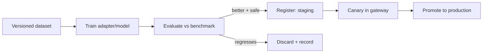

# Fine-Tuning Strategy

> **Purpose.** Define how and when we adapt models via instruction tuning and
> parameter-efficient methods (LoRA/QLoRA), and the guardrails around it.

## 1. When to Fine-Tune

Fine-tune only when prompting + RAG demonstrably plateau on measured tasks
([DulaAIStrategy.md](./DulaAIStrategy.md) §3). Fine-tune **behavior/format/reasoning**,
not volatile facts (use RAG for facts).

## 2. Methods (in order of cost)

| Method | Use | Cost |
|--------|-----|------|
| Instruction tuning (SFT) | Teach task formats & reasoning style | Medium |
| LoRA | Efficient domain adaptation; swappable adapters | Low |
| QLoRA | LoRA on quantized base for larger models on less VRAM | Low–Medium |
| Preference opt (DPO/RLAIF) | Align to preferred outputs | RESEARCH (Stage 14) |

Adapters (LoRA) are preferred because they are **composable and swappable** — multiple
task adapters over one base, served efficiently, and easy to roll back.

## 3. Workflow

## 4. Data

- Uses curated, licensed, deduplicated datasets
  ([./DatasetStrategy.md](./DatasetStrategy.md), [./DataPipeline.md](./DataPipeline.md)).
- Synthetic/model-generated instruction data records its generator and prompt for
  reproducibility ([../09-MLOps/DatasetVersioning.md](../09-MLOps/DatasetVersioning.md)).

## 5. Evaluation & Safety Gate

- Must beat the current production config on the benchmark **and** pass safety evaluation
  (no increase in unsafe/dual-use compliance) before promotion
  ([./EvaluationStrategy.md](./EvaluationStrategy.md),
  [../15-Testing/AIEvaluation.md](../15-Testing/AIEvaluation.md)).

## 6. Serving Adapters

- LoRA adapters served via the runtime (vLLM supports adapters); quantized variants
  produced for constrained/air-gapped serving ([./ModelOptimization.md](./ModelOptimization.md)).

## Related Documents

- [./TrainingStrategy.md](./TrainingStrategy.md) · [./DulaAIStrategy.md](./DulaAIStrategy.md)
