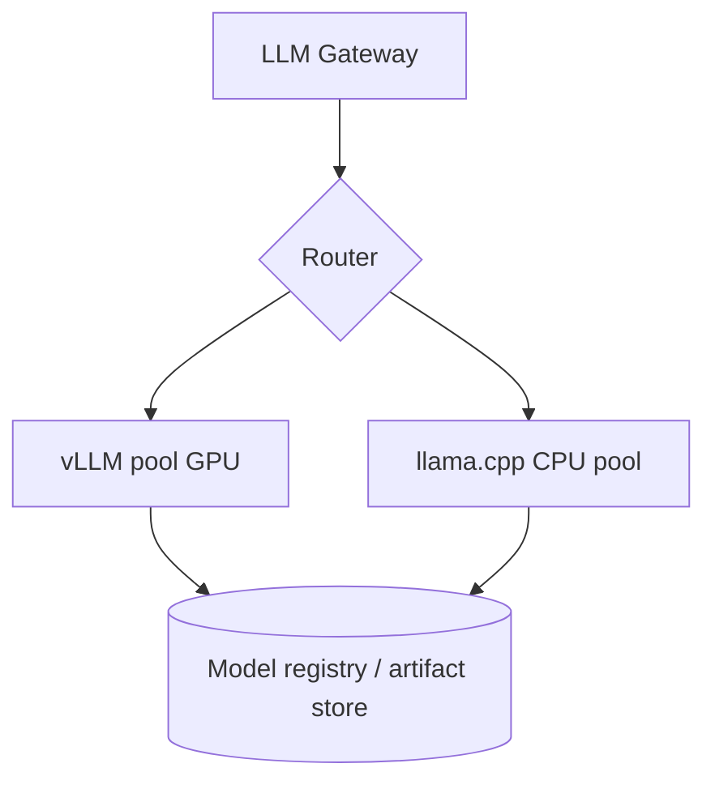

# Inference Architecture

> **Purpose.** Define how models are served across hardware and deployment profiles,
> behind the LLM gateway. Must support GPU (high throughput) and CPU/air-gapped
> (quantized) serving.

## 1. Serving Runtimes

| Runtime | Target | Notes |
|---------|--------|-------|
| vLLM | GPU, high throughput | paged attention, continuous batching, LoRA adapters |
| llama.cpp / GGUF | CPU / edge / air-gapped | quantized models, low resource |
| Ollama | dev / small on-prem | wraps llama.cpp; great DX |

Selection is per deployment profile; all sit **behind the LLM gateway**
([../03-Architecture/AIArchitecture.md](../03-Architecture/AIArchitecture.md)) — ADR-0005.

## 2. Topology

- GPU pools use GPU-aware scheduling and autoscaling; CPU pools cover offline/low-resource.
- Models/adapters loaded from the registry/object store; in air-gapped installs they come
  from the offline bundle.

## 3. Performance Features

- Continuous batching, KV-cache reuse, prompt caching, and (where supported) speculative
  decoding for latency/throughput ([./ModelOptimization.md](./ModelOptimization.md)).
- Streaming responses (SSE) to the UI for responsive chat/agent experiences.

## 4. Scaling & Capacity

- Horizontal scale of serving pools independent of platform services.
- Capacity planning and load testing: [../15-Testing/PerformanceTesting.md](../15-Testing/PerformanceTesting.md).
- Concrete throughput/latency numbers are **REQUIRES RESEARCH** (measured per model/hardware).

## 5. Reliability

- Health checks, graceful degradation (fall back to smaller/quantized model or non-AI
  paths), timeouts and circuit breakers at the gateway.

## 6. Air-Gapped Serving

- Fully local; no external providers; quantized models sized to available on-prem hardware
  ([../11-Deployment/AirGappedDeployment.md](../11-Deployment/AirGappedDeployment.md)).

## Related Documents

- [../03-Architecture/AIArchitecture.md](../03-Architecture/AIArchitecture.md) ·
  [./ModelOptimization.md](./ModelOptimization.md)
