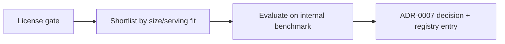

# Model Selection

> **Purpose.** Define how base models are chosen. The **licensing policy and candidate set
> are decided (ADR-0007, Accepted):** prefer Apache-2.0 families (Qwen/Mistral). The
> **specific checkpoint/size remains empirical** (chosen by benchmark), and current model
> capability facts are **REQUIRES RESEARCH** — verify against primary sources at selection
> time, since model families/licenses/benchmarks change quickly.

## 1. Selection Criteria

| Criterion | Why it matters here |
|-----------|---------------------|
| License | Must permit commercial + on-prem + air-gapped redistribution ([../01-Project/Dependencies.md](../01-Project/Dependencies.md)) |
| Openness of weights | Required for local/offline serving and fine-tuning |
| Sizes available | Need a range: small (CPU/air-gap) to larger (GPU) |
| Quality on security tasks | Measured on our benchmark, not marketing claims |
| Tool-calling ability | Needed for agents |
| Context length | Long security logs/reports |
| Fine-tune friendliness | LoRA/QLoRA support, community tooling |
| Serving support | Works with vLLM/llama.cpp; quantization available |
| Language coverage | As required by target users |

## 2. Candidate Families — **ADR-0007 (Accepted)**

Licensing was verified in the M000 review (Aug 2026):

- **Preferred (Apache-2.0): Qwen and Mistral families** — clean commercial use, self-hosting,
  air-gapped redistribution, and fine-tuning. These are the **primary base-model candidates**.
- **Deprioritized for the core: Llama** — Meta **Community License** (acceptable-use policy,
  derivative-naming requirement, large-platform commercial threshold, EU/regional multimodal
  restrictions). Usable only where its terms are acceptable for a specific deployment; never
  assumed license-clean.
- **Also shortlist:** Gemma / Phi (verify current license terms at selection).

> The **specific checkpoint and size are chosen empirically** by the internal benchmark
> ([./Benchmarking.md](./Benchmarking.md)); this policy fixes the license gate and candidate
> set. **Model-weight provenance/hashes are verified on load** (supply chain). Specific
> capability numbers remain **REQUIRES RESEARCH** until measured. See
> [../adr/ADR-0007-base-model.md](../adr/ADR-0007-base-model.md).

## 3. Model Tiers

The platform serves multiple tiers behind the gateway ([../03-Architecture/AIArchitecture.md](../03-Architecture/AIArchitecture.md)):

- **Tier S (small):** CPU/air-gapped, quantized; fast, lower quality.
- **Tier M (mid):** single-GPU; balanced.
- **Tier L (large):** multi-GPU; highest quality.
- **Task models:** small specialized models for classify/extract (Stage 13).

The router selects tier by task, profile, and available hardware.

## 4. Selection Process

Every candidate passes the license gate, then is measured on the benchmark
([./Benchmarking.md](./Benchmarking.md)); the decision and rationale are recorded as an
ADR and the chosen model registered ([../09-MLOps/ModelRegistry.md](../09-MLOps/ModelRegistry.md)).

## 5. Re-Selection

- Base model choice is revisited as the field evolves; the abstraction (gateway + registry)
  makes swapping low-cost. A new base model is adopted only if it beats the incumbent on
  the benchmark.

## Related Documents

- [./DulaAIStrategy.md](./DulaAIStrategy.md) · [./EvaluationStrategy.md](./EvaluationStrategy.md)
