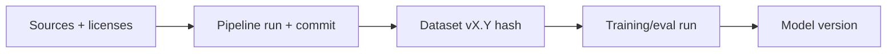

# Dataset Versioning & Lineage

> **Purpose.** Guarantee datasets are immutable, versioned, and traceable end-to-end.

## 1. Approach

- **DVC** tracks dataset versions with content hashing; large files in object storage
  (MinIO/S3). Metadata (source, license, provenance, pipeline run) stored alongside.
- Naming: `<domain>-<purpose>-v<major.minor>`
  ([../00-Governance/NamingConventions.md](../00-Governance/NamingConventions.md)).
- **LakeFS** is a candidate if DVC scaling is insufficient (ADR-0010).

## 2. Immutability & Splits

- Each version is immutable; changes create a new version.
- Splits (`train/validation/test/eval`) recorded; the **eval** split is isolated and
  never used in training ([../08-AI/DatasetStrategy.md](../08-AI/DatasetStrategy.md)).

## 3. Lineage

Every model version links back to exact dataset versions and the pipeline run that built
them — full lineage for audit and reproducibility.

## 4. Provenance & Licensing

- Provenance (source, acquisition method/date, license) is mandatory metadata; datasets
  failing the license gate cannot be registered
  ([../01-Project/Dependencies.md](../01-Project/Dependencies.md)).

## 5. Synthetic Data Records

- Model-generated data records generator model+version, prompt, and date; flagged as
  synthetic; validated before training use.

## 6. Contamination Control

- Automated zero-overlap assertion between training inputs and the benchmark/eval set
  ([../08-AI/Benchmarking.md](../08-AI/Benchmarking.md)).
