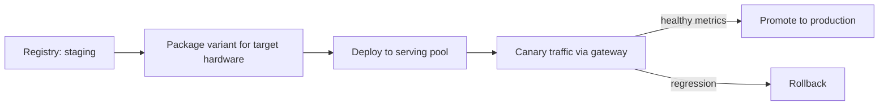

# Model Deployment Pipelines

> **Purpose.** Define how a promoted model reaches production serving safely, with canary
> and rollback, across deployment profiles.

> **Implementation status (Phase 10, CURRENT).** §2 (canary + rollback) is implemented:
> `CanaryProvider` (`packages/dula-ai/src/dula_ai/providers.py`) routes a configurable fraction
> of gateway traffic to a candidate; rollback is `dula_ml.lifecycle.rollback()` re-pointing the
> `production` stage tag, triggered automatically on a detected regression
> (`ml/dula_train/monitor.py`, scheduled via `deploy/argo/dula-ai-monitor-cronworkflow.yaml`) or
> manually. §1/§3 (GitOps promotion, profile-aware serving) is implemented for cloud/on-prem via
> the `serving` Helm component (`deploy/helm/dula/values.yaml`, disabled by default — no Dula AI
> checkpoint has shipped yet); air-gapped bundled-artifact serving remains as described, FUTURE.
> See `docs/16-Operations/DulaAITrainingRunbook.md` for the operational runbook.

## 1. Flow

## 2. Canary & Rollout

- The LLM gateway routes a fraction of traffic to the candidate; live quality/safety and
  latency are monitored before full promotion.
- Rollback = re-point the `production` stage tag ([./ModelRegistry.md](./ModelRegistry.md)).

## 3. Profile Awareness

- Cloud/on-prem: pull variant from registry; GPU or CPU pool per hardware.
- **Air-gapped:** model variants ship in the offline bundle; "deploy" = load bundled
  artifact; no external pull ([../11-Deployment/AirGappedDeployment.md](../11-Deployment/AirGappedDeployment.md)).

## 4. GitOps

- Serving config (which model/stage per environment) is declarative and delivered via Argo
  CD, keeping deployments auditable and reversible.

## 5. Safety

- A model cannot be deployed unless its registry entry shows a passing eval+safety gate
  ([./EvaluationPipelines.md](./EvaluationPipelines.md)).
