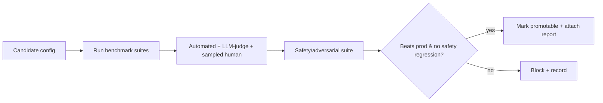

# Evaluation Pipelines

> **Purpose.** Automate the evaluation gate so quality/safety are measured consistently and
> block promotion on regression.

> **Implementation status (Phase 04/10, CURRENT).** The gate (`dula_ml.evaluation.decide`) is
> a single function used two ways: `ml/dula_train/decide.py` runs it for a brand-new candidate
> against the general-model baseline (§1 "on every candidate model" trigger); `dula_ml.monitor`
> runs the *same* function on a schedule (§1 "and on a schedule to detect drift" trigger),
> comparing a freshly computed evaluation against the current production version's own recorded
> baseline. §5 (contamination assertion) is enforced at `data_prep` time
> (`dula_ml.contamination`), not a separate pipeline stage. §6 (air-gapped) holds: both trigger
> paths run entirely offline against the bundled/local benchmark.

## 1. Triggering

- On every candidate model, prompt change, RAG change, and agent change; also on a
  schedule to detect drift.

## 2. Pipeline

## 3. Gate Rules

- Encodes the rules in [../08-AI/EvaluationStrategy.md](../08-AI/EvaluationStrategy.md):
  must match/beat production on primary metrics and show **no** safety regression.

## 4. Reports

- Machine-readable + human-readable reports stored and attached to the registry entry
  ([./ModelRegistry.md](./ModelRegistry.md)); comparable across versions via the fixed
  benchmark ([../08-AI/Benchmarking.md](../08-AI/Benchmarking.md)).

## 5. Contamination Assertion

- Pipeline asserts zero overlap between training inputs and eval set before trusting
  results.

## 6. Air-Gapped

- Runs fully offline using local models and the bundled benchmark.
