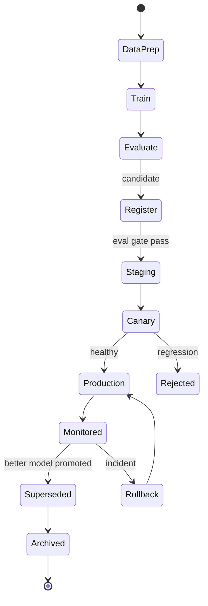

# Model Lifecycle

> **Purpose.** Tie the MLOps pieces into one end-to-end lifecycle from data to retirement,
> with monitoring and rollback.

> **Implementation status (Phase 10, CURRENT).** The state machine in §1 is implemented
> (`dula_ml.lifecycle`, `RegistryEntry.stage`) with one simplification: `Monitored` isn't a
> distinct stage (a `production` entry *is* monitored, via the scheduled job in §3), and
> `Rollback` isn't a separate stage either -- it's re-promoting a `Superseded` entry straight
> back to `Production` (`superseded -> production` is a legal edge). §3 (production monitoring)
> and §4 (rollback) are implemented as described; see
> `docs/16-Operations/DulaAITrainingRunbook.md` for how to run it.

## 1. End-to-End Lifecycle

## 2. Stage Ownership

| Stage | Owner | Reference |
|-------|-------|-----------|
| Data prep | Data/AI | [../08-AI/DataPipeline.md](../08-AI/DataPipeline.md) |
| Train | AI | [./TrainingPipelines.md](./TrainingPipelines.md) |
| Evaluate | AI/QA | [./EvaluationPipelines.md](./EvaluationPipelines.md) |
| Register/Deploy | MLOps | [./ModelRegistry.md](./ModelRegistry.md), [./DeploymentPipelines.md](./DeploymentPipelines.md) |
| Monitor | Ops/AI | [../16-Operations/Monitoring.md](../16-Operations/Monitoring.md) |

## 3. Production Monitoring

- Track quality signals, drift, latency, cost, safety incidents; alert on regression.
- Scheduled re-evaluation catches drift from changing knowledge indices.

## 4. Rollback & Incident

- Any safety/quality incident triggers rollback to the last-good production version and an
  incident process ([../16-Operations/IncidentManagement.md](../16-Operations/IncidentManagement.md)).

## 5. Retirement

- Superseded models are archived (retained for audit/rollback), then removed per retention
  policy.

## 6. Lineage & Audit

- Every production model traces to its data, code, config, and eval report — auditable end
  to end ([./DatasetVersioning.md](./DatasetVersioning.md)).
