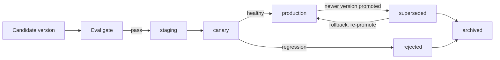

# Model Registry

> **Purpose.** Single source of truth for model artifacts, versions, variants, stages, and
> their evaluation reports.

> **Implementation status (Phase 04, CURRENT).** A portable registry **manifest** + **model
> card** are implemented in `packages/dula-ml` (`registry.py`, `modelcard.py`): every candidate
> records base model, method (QLoRA), dataset version, candidate-vs-baseline metrics, the
> ship/retire gate decision, and a weight hash (supply-chain), and travels with the artifact
> (e.g. to the Hugging Face Hub, ADR-0012). MLflow remains the experiment system of record; this
> manifest is the artifact-side, git/HF-friendly record. Artifact naming follows
> `dula-<base>-<task>-<method>-vX.Y`.
>
> **Implementation status (Phase 10, CURRENT).** Stage transitions from §3/§5 below are
> implemented in `dula_ml.lifecycle` (`promote()`, `current_production()`), exposed via the
> `ml/dula_train/promote.py` CLI. Each transition is a new entry appended to the same
> append-only manifest (never a mutation of a past one); the state machine enforces legal edges
> only (e.g. a candidate must pass through `staging` and `canary` before `production`); and
> rollback (§5) is implemented exactly as described — re-promoting a `superseded` version
> straight back to `production`, which automatically supersedes whatever is currently there.

## 1. What the Registry Holds

- Model versions (base + adapters), with lineage to dataset/experiment.
- Variants per version (full, INT8, INT4, GGUF/AWQ) for different hardware.
- Evaluation/benchmark reports attached to each version.
- Stage tags: `staging`, `canary`, `production`, `rejected`, `superseded`, `archived`
  (`dula_ml.lifecycle.STAGES`).
- Naming per [../00-Governance/NamingConventions.md](../00-Governance/NamingConventions.md)
  (`dula-<base>-<task>-<method>-vX.Y`).

## 2. Tooling

- **MLflow Model Registry** (self-hosted, air-gap capable); artifacts in object storage.

## 3. Promotion Flow

Promotion requires passing the evaluation gate
([../08-AI/EvaluationStrategy.md](../08-AI/EvaluationStrategy.md)); details in
[./ModelLifecycle.md](./ModelLifecycle.md).

## 4. Consumption

- The LLM gateway/serving loads models by registry reference and stage
  ([../08-AI/InferenceArchitecture.md](../08-AI/InferenceArchitecture.md)); air-gapped
  installs import registry contents via the offline bundle.

## 5. Rollback

- Previous `production` version is retained; rollback = re-point stage tag. Fast and
  auditable.

## 6. Access Control & Audit

- Registry access is authenticated/authorized; all stage changes are audited.
