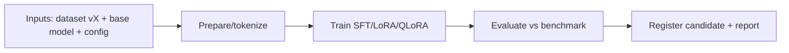

# Training Pipelines

> **Purpose.** Define the automated, reproducible pipelines that produce model artifacts.

## 1. Orchestration

- **Argo Workflows** on Kubernetes; pipeline definitions live in `ml/training` as code.
- Each pipeline is parameterized (dataset version, base model, hyperparameters) and fully
  tracked ([./ExperimentTracking.md](./ExperimentTracking.md)).

## 2. Pipeline Stages

## 3. Reproducibility

- Pinned containers (CUDA/PyTorch), deterministic seeds, recorded configs, dataset version
  hashes; re-running the pipeline reproduces the artifact within variance.

## 4. Resource Management

- GPU scheduling via K8s; jobs sized per task; cost/time recorded. Hardware needs are
  estimates until measured ([../08-AI/TrainingStrategy.md](../08-AI/TrainingStrategy.md)).

## 5. Safety Steps

- Data safety filtering pre-train; safety evaluation post-train is part of the eval stage
  ([../10-Security/AIThreatModel.md](../10-Security/AIThreatModel.md)).

## 6. Gate

- The pipeline registers a **candidate** only; promotion happens via
  [./EvaluationPipelines.md](./EvaluationPipelines.md) + [./ModelLifecycle.md](./ModelLifecycle.md).
