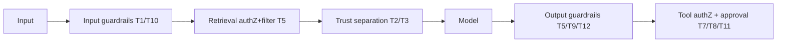

# AI Threat Model

> **Purpose.** Address threats unique to LLM/RAG/agent systems. Mapped to the
> **OWASP Top 10 for LLM Applications : 2025** (verified current in the M000 review — see
> [../PROJECT_REVIEW-M000.md](../PROJECT_REVIEW-M000.md) §7). Core stance:
> **all model output and all retrieved/tool content is untrusted.**

## 1. Threats & Mitigations

| # | Threat | Description | Mitigations |
|---|--------|-------------|-------------|
| T1 | Prompt injection (direct) | User input overrides instructions | Instruction/content separation, input guardrails, least-privilege tools, output validation |
| T2 | Indirect prompt injection | Malicious instructions inside retrieved/tool content | Treat retrieved content as data; delimit clearly; sanitize; provenance tracking |
| T3 | RAG poisoning | Attacker seeds malicious content into the index | Source validation, provenance, ingestion review, ability to purge by source |
| T4 | Data/training poisoning | Malicious data corrupts a tuned model | Licensed/curated data, dedup, provenance, eval+safety gate |
| T5 | Sensitive info disclosure | Model leaks secrets/other-tenant data | authZ at retrieval, output filters, no secrets in context, tenant isolation |
| T6 | Model extraction/theft | Stealing model behavior or weights | Rate limits/quotas, auth, artifact access control, watermark research (RESEARCH) |
| T7 | Tool abuse | Model triggers harmful tool actions | Permissioned tools, human approval for consequential actions |
| T8 | Agent privilege escalation | Agent exceeds user's rights | Agent inherits user scope; no escalation; OPA checks per action |
| T9 | Insecure output handling | Downstream trusts model output blindly | Validate/sanitize outputs; never exec model output; schema enforcement |
| T10 | Denial of wallet/resource | Expensive prompts exhaust resources | Quotas, token/step/time limits, cost caps |
| T11 | Excessive agency | Agent does too much autonomously | Step/loop limits, approvals, scoped goals |
| T12 | Overreliance / hallucination (misinformation) | Users trust wrong answers | Grounding + citations, uncertainty signaling, eval on hallucination |
| T13 | System prompt leakage | System/instructions exposed to users | Assume prompts leak — **no secrets/policy-criticals in prompts**; treat prompts as non-secret |
| T14 | Vector & embedding weaknesses | Cross-tenant retrieval, embedding inversion, membership inference | Per-tenant namespaces + authZ-at-retrieval; no shared prompt/KV/response cache across tenants; access-controlled indices |
| T15 | Unbounded consumption (denial of wallet) | Expensive prompts/loops exhaust GPU/tokens/cost | Per-tenant token & cost budgets, step/loop/time caps, quotas at the gateway |

## 1a. OWASP Top 10 for LLM Applications : 2025 — Mapping

| OWASP 2025 | Dula threats | Where enforced |
|-----------|--------------|----------------|
| LLM01 Prompt Injection | T1, T2 | Gateway input guardrails; trust separation |
| LLM02 Sensitive Information Disclosure | T5 | Retrieval authZ; output filters; audit redaction |
| LLM03 Supply Chain | (see [ThreatModel.md](./ThreatModel.md), [SupplyChainSecurity.md](./SupplyChainSecurity.md)) + model-weight provenance | Signed artifacts; weight hash verification |
| LLM04 Data & Model Poisoning | T3, T4 | Source validation, provenance, eval+safety gate |
| LLM05 Improper Output Handling | T9 | Never exec model output; schema validation |
| LLM06 Excessive Agency | T7, T8, T11 | Permissions + human approval + limits |
| LLM07 System Prompt Leakage | T13 | No secrets in prompts |
| LLM08 Vector & Embedding Weaknesses | T14 | Tenant namespaces; authZ-at-retrieval; no cross-tenant cache |
| LLM09 Misinformation | T12 | Grounding + citations + hallucination eval |
| LLM10 Unbounded Consumption | T10, T15 | Token/cost budgets, quotas, step/time caps |

## 2. Enforcement Points

All enforced centrally at the **LLM gateway** and **agent runtime**
([../03-Architecture/AIArchitecture.md](../03-Architecture/AIArchitecture.md),
[../03-Architecture/AgentArchitecture.md](../03-Architecture/AgentArchitecture.md)).

## 3. Dual-Use & Safety

- Dula assists legitimate defense/research/authorized testing only; it must refuse
  operational offensive requests (exploit generation, attack automation, malicious
  evasion). Safety is evaluated with adversarial suites
  ([../08-AI/EvaluationStrategy.md](../08-AI/EvaluationStrategy.md)) and gated on release.

## 4. Testing

- Red-team/adversarial testing (injection, jailbreak, exfiltration) is part of security
  testing ([./SecurityTesting.md](./SecurityTesting.md)) and the eval gate.

## Related Documents

- [./AgentSecurity.md](./AgentSecurity.md) · [./ThreatModel.md](./ThreatModel.md)
