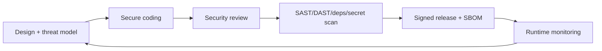

# Secure Development (Secure SDLC)

> **Purpose.** Define how security is built into the development lifecycle, not bolted on.

## 1. Lifecycle Integration

## 2. Design Phase

- Threat-model new features touching trust boundaries ([./ThreatModel.md](./ThreatModel.md)).
- Security-impacting decisions become ADRs.

## 3. Coding Phase

- Follow [../00-Governance/CodingStandards.md](../00-Governance/CodingStandards.md) §7
  (input validation, parameterized queries, authZ at service layer, untrusted AI content).
- No secrets in code; use Vault/SOPS ([./DataSecurity.md](./DataSecurity.md)).

## 4. Review Phase

- Two-reviewer rule for security-critical paths (authN/authZ, agent/plugin exec, secrets,
  crypto, model serving) — [../00-Governance/RepositoryGovernance.md](../00-Governance/RepositoryGovernance.md).

## 5. Automated Gates (CI)

- SAST, dependency CVE scan, license check, secret scan, container scan; failures block
  merge/release. DAST against staging.

## 6. Release Phase

- Signed images, SBOM, provenance ([./SupplyChainSecurity.md](./SupplyChainSecurity.md)).

## 7. Runtime

- Monitoring/alerting ([../16-Operations/Monitoring.md](../16-Operations/Monitoring.md));
  incident response ([../16-Operations/IncidentManagement.md](../16-Operations/IncidentManagement.md)).

## 8. Training & Ownership

- Contributors follow these standards; CODEOWNERS routes security reviews; the security
  owner maintains this program.
