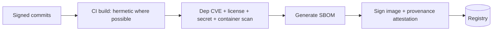

# Supply Chain Security

> **Purpose.** Ensure the integrity of what we build and ship — code, dependencies, images,
> models, and datasets — across all deployment profiles including air-gapped.

## 1. Objectives

- Know exactly what is in every release (SBOM).
- Verify integrity/provenance of artifacts (signing + attestation).
- Detect vulnerable/mis-licensed dependencies before release.
- Support secure offline distribution for air-gapped installs.

## 2. Build Integrity

- Pinned, digest-referenced base images; minimal/distroless.
- SBOM per artifact; images signed; provenance attestations (aim toward SLSA-style
  guarantees — **REQUIRES RESEARCH** on target level).

## 3. Dependency Governance

- License gate + CVE scan per [../01-Project/Dependencies.md](../01-Project/Dependencies.md);
  lockfiles committed; scheduled updates with full gates.

## 4. Model & Dataset Integrity

- Models/datasets are hash-addressed and provenance-tracked
  ([../09-MLOps/DatasetVersioning.md](../09-MLOps/DatasetVersioning.md),
  [../09-MLOps/ModelRegistry.md](../09-MLOps/ModelRegistry.md)); verify hashes on load.

## 5. Air-Gapped Distribution

- Offline bundle (images + charts + models + SBOM) is signed; verified on import into the
  customer's private registry — no direct internet at deploy time
  ([../11-Deployment/AirGappedDeployment.md](../11-Deployment/AirGappedDeployment.md)).

## 6. Verification at Deploy

- Admission controls verify image signatures/provenance before running in the cluster
  (**REQUIRES DECISION** on policy engine, e.g. sigstore/cosign + Kyverno/Gatekeeper).
