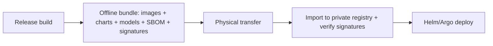

# Air-Gapped Deployment

> **Purpose.** Define deployment into environments with **no external network access** —
> a first-class, hard requirement that shapes the entire architecture.

## 1. Constraints

- **Zero external egress** at build-consumption and runtime.
- No external model/API dependency; all AI runs locally.
- Updates arrive only via a physically transferred, signed **offline bundle**.

## 2. Offline Bundle

- Bundle contains: all signed container images, Helm charts, model variants (quantized for
  local hardware), embedding models, SBOM, and signatures.
- Integrity verified on import ([../10-Security/SupplyChainSecurity.md](../10-Security/SupplyChainSecurity.md)).

## 3. Models

- Local serving only (vLLM/llama.cpp); quantized variants sized to available hardware
  ([../08-AI/InferenceArchitecture.md](../08-AI/InferenceArchitecture.md),
  [../08-AI/ModelOptimization.md](../08-AI/ModelOptimization.md)). No external providers.

## 4. Knowledge Freshness

- Threat intel / CVE / advisory updates are delivered as **signed content bundles** on the
  same offline cadence; the platform records the knowledge snapshot version used
  ([../08-AI/RAGEngineering.md](../08-AI/RAGEngineering.md)).

## 5. Plugins/Integrations

- Only internal-endpoint integrations function; external-egress plugins are inert
  ([../10-Security/PluginSecurity.md](../10-Security/PluginSecurity.md)).

## 6. Secrets, Backup, DR

- On-prem Vault/KMS; customer-owned backups; DR entirely within the enclave
  ([./DisasterRecovery.md](./DisasterRecovery.md)).

## 7. Verification

- A "no-egress" test asserts the deployment makes zero external calls (part of security
  testing — [../10-Security/SecurityTesting.md](../10-Security/SecurityTesting.md)).

## 8. Design Implication

- Any feature that *requires* external calls is either made optional or provided an
  internal alternative; otherwise it cannot ship as core.
