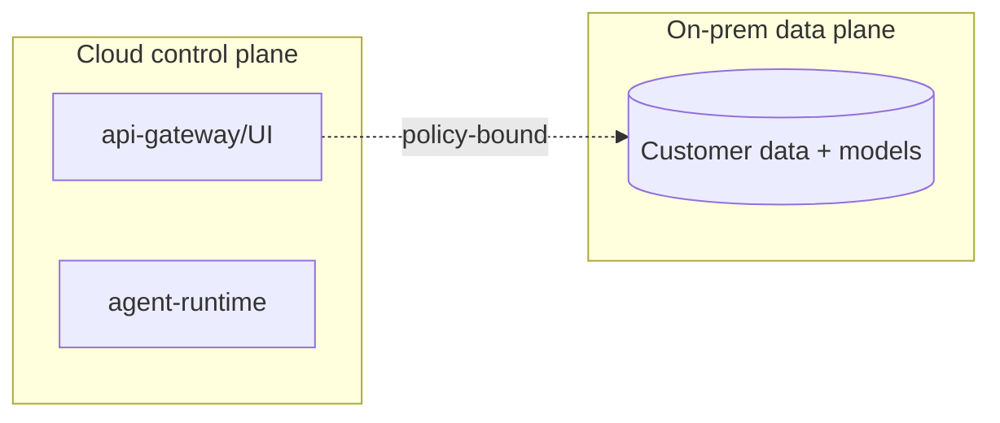

# Cloud Deployment

> **Purpose.** Define cloud deployment (and the hybrid variant), building on the K8s
> baseline, while preserving portability and avoiding hard vendor lock-in.

## 1. Approach

- Run the same Helm charts on a managed Kubernetes service.
- **Optional** managed equivalents (managed Postgres, object storage, GPU nodes) are
  allowed but never *required* by core code — preserving on-prem/air-gapped parity.

## 2. Cloud-Specific Concerns

- GPU node pools for vLLM; autoscaling; spot/preemptible for batch training (not serving).
- Cloud KMS for encryption keys (or Vault); IAM for workload identity.
- Managed load balancing/ingress and DNS/TLS.

## 3. Hybrid

- Hybrid keeps sensitive **data and models on-prem** while control/UI may run in cloud;
  data-residency policy enforced. Suits customers who want cloud convenience with data
  sovereignty ([../02-Vision/ProductStrategy.md](../02-Vision/ProductStrategy.md)).

## 4. IaC

- Terraform provisions cloud primitives (network, cluster, storage); Helm/Argo deploy the
  app ([../01-Project/TechnologyStack.md](../01-Project/TechnologyStack.md)).

## 5. Cost & Scaling

- Elastic scaling of services and GPU serving; cost monitoring
  ([../16-Operations/Monitoring.md](../16-Operations/Monitoring.md)).

## 6. Lock-In Avoidance

- No dependency on cloud-proprietary services in core; managed services are pluggable
  behind the same interfaces used on-prem.
