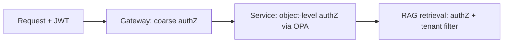

# Authorization

> **Purpose.** Define access control: RBAC + ABAC via OPA, enforced consistently and at
> the right layers (ADR-0009).

## 1. Model

- **RBAC** for coarse roles (analyst, hunter, responder, engineer, admin) mapped to
  personas ([../02-Vision/TargetUsers.md](../02-Vision/TargetUsers.md)).
- **ABAC** for fine-grained decisions using attributes: tenant, resource owner, data
  classification, environment.
- Policies expressed in **OPA/Rego**, externalized from services for consistency.

## 2. Enforcement Points

- Enforced at the **service layer** (not just UI) and at **RAG retrieval** so the model
  never sees unauthorized/other-tenant content ([../03-Architecture/RAGArchitecture.md](../03-Architecture/RAGArchitecture.md)).

## 3. Multi-Tenancy

- Every decision includes tenant scope; combined with DB RLS and index namespacing for
  defense-in-depth ([../10-Security/DataSecurity.md](../10-Security/DataSecurity.md)).

## 4. Least Privilege

- Default deny; grant minimal necessary. Agents/plugins get a **subset** of the invoking
  user's permissions — no escalation
  ([../13-Agents/AgentPermissions.md](../13-Agents/AgentPermissions.md)).

## 5. Consequential Actions

- Beyond authZ, consequential/irreversible actions require human approval
  ([../13-Agents/HumanApproval.md](../13-Agents/HumanApproval.md)).

## 6. Auditing

- All authorization decisions (allow/deny) are audited with context.

## 7. Testing

- Policy unit tests (Rego) + integration tests asserting tenant isolation and object-level
  authZ ([../15-Testing/SecurityTesting.md](../15-Testing/SecurityTesting.md)).
