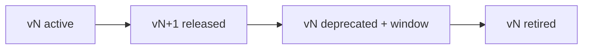

# API Versioning

> **Purpose.** Define how APIs evolve without breaking consumers.

## 1. Versioning Scheme

- Major version in the path: `/api/v{major}/...`.
- **Additive, backward-compatible** changes within a major (new fields/endpoints;
  never remove/repurpose existing fields).
- **Breaking** changes require a new major version.

## 2. Deprecation Policy

- Announce deprecations with a defined support window; emit deprecation headers/warnings;
  document migration.

## 3. Contracts & Compatibility

- Contract tests prevent accidental breaking changes
  ([../15-Testing/IntegrationTesting.md](../15-Testing/IntegrationTesting.md)); generated
  clients track versions.

## 4. Internal APIs

- Internal gRPC contracts evolve with proto compatibility rules; coordinated within the
  monorepo release ([../01-Project/ReleaseStrategy.md](../01-Project/ReleaseStrategy.md)).

## 5. AI Contract Versioning

- Prompt/response contracts and model selection are versioned so agents/RAG can pin
  behavior across model changes
  ([../03-Architecture/AIArchitecture.md](../03-Architecture/AIArchitecture.md)).

## 6. Documentation

- Each active version has published reference docs generated from its spec.
