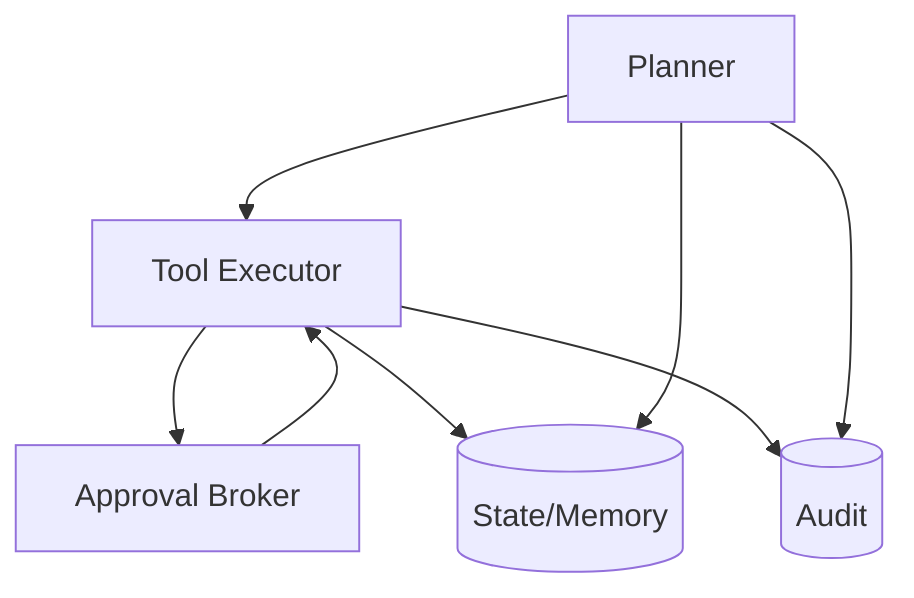

# Agent Framework

> **Purpose.** Define the structure of the agent runtime. Per **ADR-0008 (Accepted)** the
> runtime is **built on LangGraph** for graph execution/checkpointing, with Dula's
> permission/approval/audit as a first-party layer around it.

## 1. Components

- **Planner:** produces the next step given goal, state, and available tools.
- **Tool executor:** validates, permission-checks, and runs tool calls (only component
  that executes tools).
- **Memory/state:** run context, intermediate results, checkpoints.
- **Approval broker:** pauses for human approval on consequential actions.
- **Auditor:** records the full trace.

## 2. Execution Model

- Graph-based plan/act loop with explicit checkpoints (supports pause/resume for approval,
  determinism, and replay) — see runtime diagram in
  [../03-Architecture/AgentArchitecture.md](../03-Architecture/AgentArchitecture.md).

## 3. Determinism & Limits

- Step/loop/time/cost caps; reproducible traces; no unbounded autonomy
  ([../10-Security/AgentSecurity.md](../10-Security/AgentSecurity.md)).

## 4. Agent Definitions

- Agents are declarative: role, goal scope, allowed tools, permission scope, approval
  policy. Named per [../00-Governance/NamingConventions.md](../00-Governance/NamingConventions.md) §10.

## 5. Model Access

- Agents call models only via the LLM gateway
  ([../03-Architecture/AIArchitecture.md](../03-Architecture/AIArchitecture.md)); model
  output is untrusted.

## 6. Evaluation

- Agents are evaluated for success, safety, and efficiency before release
  ([../15-Testing/AgentEvaluation.md](../15-Testing/AgentEvaluation.md)).
