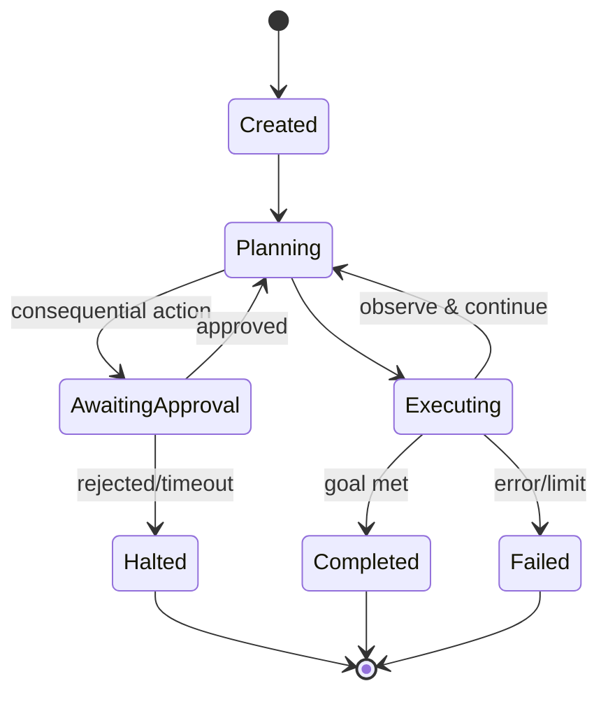

# Agent Lifecycle

> **Purpose.** Define an agent run's states from invocation to completion, including
> approval pauses and failure handling.

## 1. Run States

## 2. Run Record

- Each run has a ULID `run_id`; records goal, plan steps, tool calls (inputs/outputs),
  approvals, model calls, and outcome — immutable audit
  ([../10-Security/AgentSecurity.md](../10-Security/AgentSecurity.md)).
- **CURRENT**: the run record is held behind a `RunStore` interface. The default is in-memory
  (does not survive a restart); a Postgres-backed store is available opt-in
  (`RUN_STORE=postgres`) so the record — including who approved a consequential step — survives
  a restart, tenant-isolated the same way the domain data is ([ADR-0016](../adr/ADR-0016-agent-run-persistence.md)).

## 3. Approval Pauses

- On consequential actions, the run pauses (AwaitingApproval) and resumes on approval or
  halts on rejection/timeout ([./HumanApproval.md](./HumanApproval.md)).

## 4. Limits & Failure

- Step/loop/time/cost limits move a run to Failed with a clear reason; partial results and
  full trace retained.

## 5. Idempotency & Resumability

- Checkpoints enable safe resume; tool calls use idempotency where side-effecting
  ([../12-API/APIStandards.md](../12-API/APIStandards.md)).

## 6. Cleanup

- Ephemeral state cleared post-run per retention; audit retained
  ([../10-Security/DataSecurity.md](../10-Security/DataSecurity.md)).
- **REQUIRES DECISION**: the Postgres-backed run store (§2, ADR-0016) has no scheduled
  retention/purge job yet — runs accumulate indefinitely. Acceptable for now (a run is a small,
  audit-relevant record, not high-volume domain data); a retention policy is future work if
  volume becomes a real operational concern.
