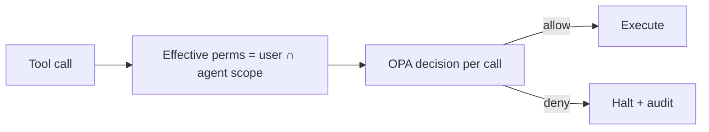

# Agent Permissions

> **Purpose.** Define the agent permission model enforcing least privilege and preventing
> escalation.

## 1. Principle: Agent ⊆ User

- An agent runs **on behalf of a user** and inherits a **subset** of that user's
  permissions. It can never perform an action the user is not authorized to perform
  ([../12-API/Authorization.md](../12-API/Authorization.md)).

## 2. Permission Scope

Each agent definition declares:

- **Allowed tools** (allowlist; default deny).
- **Data scope** (which tenant/resources/classifications).
- **Action classes** (read vs consequential).
- **Resource limits** (steps/time/cost).

## 3. Enforcement

- Every tool call is checked against the **intersection** of user and agent scope via OPA
  at execution time (not just at start).

## 4. No Self-Escalation

- The model cannot grant itself tools/permissions; permissions come from the definition +
  user identity, enforced by the runtime ([../10-Security/AgentSecurity.md](../10-Security/AgentSecurity.md)).

## 5. Consequential Actions

- Even when permitted, consequential actions additionally require human approval
  ([./HumanApproval.md](./HumanApproval.md)).

## 6. Auditing

- All permission decisions (allow/deny) are audited within the run record.

## 7. Testing

- Adversarial tests verify no escalation under prompt injection
  ([../15-Testing/AgentEvaluation.md](../15-Testing/AgentEvaluation.md)).
