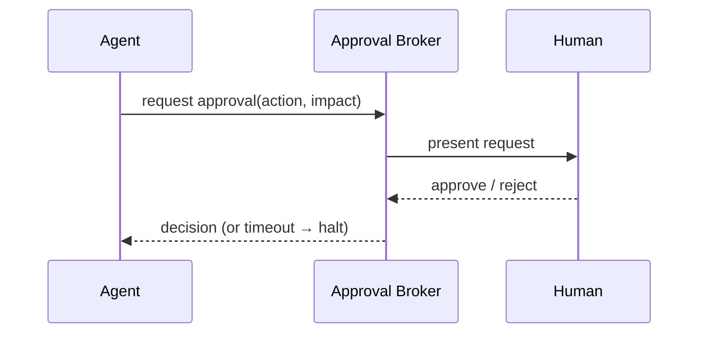

# Human Approval (Human-in-the-Loop)

> **Purpose.** Define when and how humans approve agent actions — a core safety control
> ([../02-Vision/GuidingPrinciples.md](../02-Vision/GuidingPrinciples.md) §4).

## 1. When Approval Is Required

- Any **consequential/irreversible** action: writes to external systems, containment
  (isolate host, disable account), destructive changes, or anything policy marks
  high-impact. Configurable per tenant/agent, but **default = require approval**.

## 2. Approval Request Content

- The plan/rationale, the **exact** action and parameters, predicted impact, affected
  assets, and the tool's side-effect class — enough for an informed decision.

## 3. Flow

- Run pauses (AwaitingApproval) and resumes on approve, halts on reject/timeout
  ([./AgentLifecycle.md](./AgentLifecycle.md)).

## 4. Authorization of Approvers

- Only users authorized for the action may approve it (no approving beyond your own
  permissions) ([./AgentPermissions.md](./AgentPermissions.md)).

## 5. Audit

- The request, decision, approver identity, and timestamp are recorded immutably.

## 6. Anti-Fatigue

- Batch/group related low-risk approvals thoughtfully; never auto-approve consequential
  actions; make impact clear to avoid rubber-stamping.
