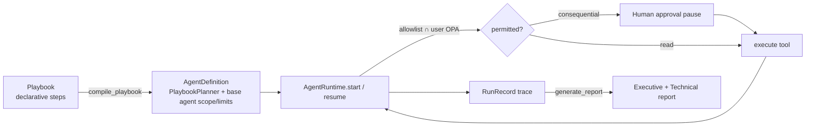

# Automation Playbooks & Reporting

> **Purpose.** Technical reference for the Phase 08 automation layer delivered in
> **`packages/dula-automation/`** and exposed by **`apps/ai-gateway`**. It composes the Phase 06
> agent runtime and the Phase 07 connectors into **declarative, approval-gated playbooks** and
> **grounded reporting**. **Status: CURRENT** (offline profile). User guide:
> [../17-User-Documentation/PlaybooksUserGuide.md](../17-User-Documentation/PlaybooksUserGuide.md).

## Design stance

Automation adds **no new execution path and no new security surface**. A playbook is a *declarative
spec* that is compiled into a `Planner` and executed by the **existing** `AgentRuntime`
([AgentImplementation.md](./AgentImplementation.md)). Every control therefore holds unchanged: each
step runs only after passing the agent's tool **allowlist** ∩ the invoking user's **authorization**
(OPA), consequential steps **pause for human approval**, run **limits** bound autonomy, and every
step is **audited**. **A playbook cannot bypass these controls** — it only decides *which permitted
step to propose next*; the runtime stays the sole executor and the single security boundary. This
is the same principle proven for agents (the planner is untrusted), now applied to a fixed,
reviewable procedure.

The planner is **stateless**: it reconstructs progress by replaying the declarative steps against
the run history on each call. A single compiled playbook is therefore safe to reuse across many
runs and to **resume out-of-band** after an approval pause (mirroring the agent planner). Conditions
and value bindings may reference only *earlier* steps, whose results are fixed once executed, which
makes the replay deterministic and **offline** — reproducible in CI and air-gapped.

## Components (`dula_automation`)

| Module | Responsibility |
|--------|----------------|
| `playbook` | The declarative model — `Ref` (path into a prior step's untrusted output), `Template` (string with `{name}` placeholders), `Condition` (`always`/`step_ok`/`ref_truthy`/`ref_nonempty`), `PlaybookStep`, `Playbook`. The stateless `PlaybookPlanner`, `validate_playbook` (fail-closed authoring guardrail), and `compile_playbook` → `AgentDefinition`. |
| `report` | `generate_report(RunRecord)` → a grounded `Report` (executive + technical narrative + cited `Evidence`). Every statement is derived from the trace and cites the step it came from (`step[i]:tool`). |
| `catalog` | `PlaybookLibrary` (validated on registration) + the built-in **`triage-enrich-ticket`** playbook, bound to the Phase 06 `investigation-assistant` agent. |

## Compilation model

A compiled playbook **inherits the base agent's least-privilege scope and limits** — the built-in
playbook cannot isolate a host because the `investigation-assistant` agent's allowlist excludes it.
`validate_playbook` additionally rejects, at authoring time, any step whose tool is outside that
allowlist, duplicate step ids, and forward references — but the runtime independently enforces the
scope on every call, so a playbook that slipped a bad tool through still could never *execute* it.

## The built-in playbook — `triage-enrich-ticket`

A supervised investigation (UC-15 automation of UC-03): `list_alerts` → `enrich_indicator`
(gated on the top alert having an indicator) → `search_logs` → **`create_ticket`** (consequential →
**approval checkpoint**). Read steps run automatically; the ticket step pauses the run until an
authorized human approves. Ticket title/body are bound from the alert via `Template`/`Ref`, so the
text is grounded in what the run actually observed, never fabricated.

## Grounded reporting

`generate_report` walks the `RunRecord` and emits an **executive summary** (counts of alerts,
indicators, techniques, corroborating logs; an approval-aware statement of any consequential action;
the run outcome) and a **technical table** (per step: permitted / approval / result), plus a list of
cited **`Evidence`**. Grounding guarantees:

- If no ticket step executed successfully, the report **does not** claim a ticket was created.
- A halted/failed/rejected run is reported as such, with the reason.
- Indicators/techniques appear only when an `enrich_indicator` step actually produced them.
- Tool outputs are labelled **untrusted evidence, not instructions** (prompt-injection hygiene).

## Security properties

- **No bypass of agent controls.** Playbook runs are agent runs; `RunRecord.unauthorized_actions()`
  must be empty for every run (release-blocking, see tests below).
- **No auto-approval of consequential actions.** The approval checkpoint is the runtime's, gated on
  the side-effect class; the approver is re-checked for the specific tool's permission.
- **Least privilege.** A playbook can never exceed its base agent's allowlist ∩ the user's rights.
- **Tenant isolation.** Runs are held in a tenant-scoped store; a run/report is never returned to a
  tenant that does not own it (ADR-0006).
- **Air-gapped.** Deterministic planner + in-memory/offline backends; no phone-home.

See [../10-Security/AgentSecurity.md](../10-Security/AgentSecurity.md).

## High-volume telemetry (scale)

Phase 08's scope includes validating high-volume telemetry ingestion on the event backbone
(ADR-0004). The per-event processing path is guarded by an **offline throughput benchmark**
(`apps/worker/tests/test_throughput.py`): a high-volume mixed stream must be processed correctly and
idempotently, with per-event cost under a conservative floor. True cluster-scale load testing is the
operational load test in [../16-Operations/TelemetryScaleTest.md](../16-Operations/TelemetryScaleTest.md)
(**FUTURE** — needs a real Redpanda cluster + load generator).

## Testing

- **Unit** (`packages/dula-automation/tests/test_playbook.py`): ref/path resolution, templates,
  conditions, validation (out-of-scope tool, duplicate id, forward ref), compile inheritance.
- **E2E + safety + reporting** (`.../test_run_and_report.py`): the built-in playbook pauses for
  approval then completes; report is grounded on completion; **no ticket claimed when rejected**;
  a missing user permission halts with **zero unauthorized actions** even under an auto-approving
  broker; the run is fully audited.
- **API** (`apps/ai-gateway/tests/test_automation.py`): list/run/approve/report, authz denial (403),
  unauthorized-tool halt, unknown playbook (404), tenant isolation.
- **Policy** (`deploy/opa/policy/authz_test.rego`): `automation.run`/`reports.read`/
  `automation.approve` for operational personas; cross-tenant + no-role denials.

## Limitations (Phase 08)

- One built-in playbook; scheduled/triggered execution and a playbook-authoring UI are **FUTURE**.
- Run store + approval broker are **in-memory** (durable persistence/notifications FUTURE).
- Reports are Markdown; PDF/branded export is **FUTURE**.
- Cluster-scale load testing is documented but not executed in CI (**FUTURE**, needs infra).
