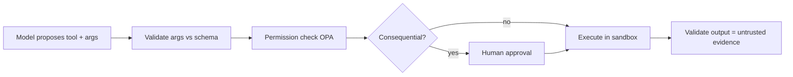

# Tool Calling

> **Purpose.** Define how agents invoke tools safely: contracts, validation, and the
> execution guarantees around them.

## 1. Tool Definition

- Tools are typed, declared capabilities: name (`verb_noun`), input schema, output schema,
  required permissions, side-effect classification (read vs consequential), and cost hints.
- Many tools are provided by connectors/plugins
  ([../14-Plugins/ConnectorStandards.md](../14-Plugins/ConnectorStandards.md)).

## 2. Call Flow

## 3. Guarantees

- **The model never executes anything directly** — it proposes; the executor enforces
  schema, permissions, and approval.
- Inputs validated; outputs validated and treated as **untrusted**
  ([../10-Security/AIThreatModel.md](../10-Security/AIThreatModel.md) T7/T9).
- No shelling out with untrusted input; no arbitrary code execution.

## 4. Side-Effect Classification

- **Read-only** tools may run without approval (still permissioned).
- **Consequential** tools (writes to external systems, containment) require approval
  ([./HumanApproval.md](./HumanApproval.md)).

## 5. Errors & Retries

- Tool errors are handled explicitly; retries only for idempotent read operations;
  failures recorded in the run trace.

## 6. Observability

- Every tool call is traced (OTel) and audited with inputs/outputs (sensitive values
  redacted per policy).
